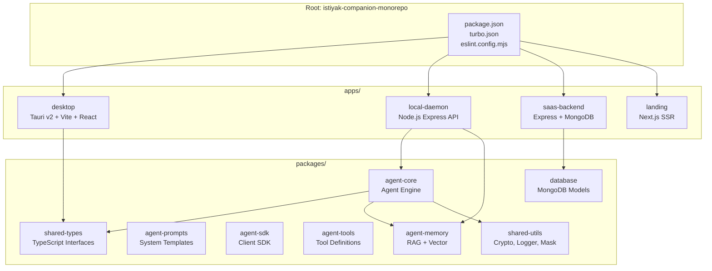
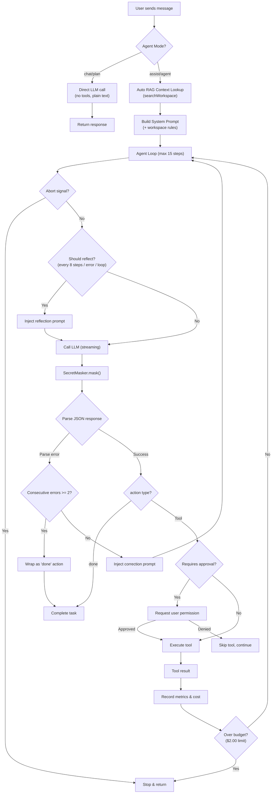
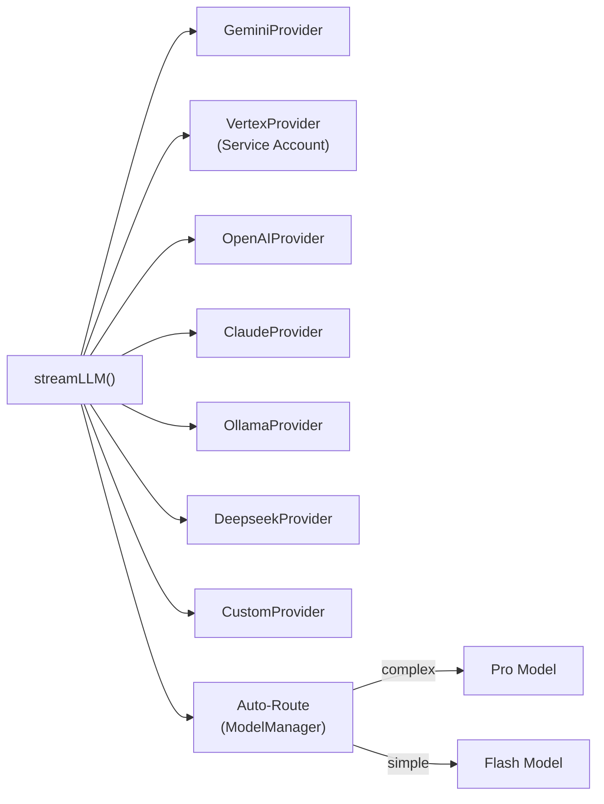
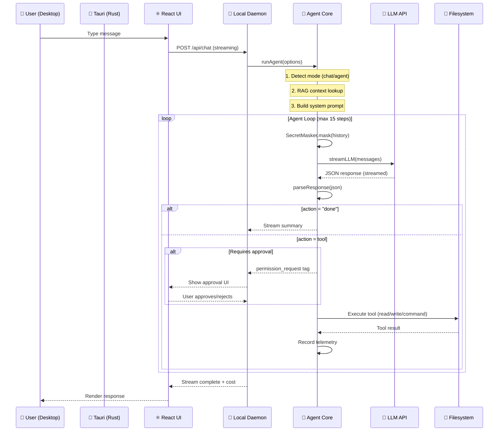
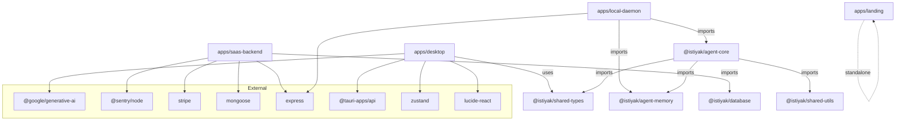

# 🧬 Istiyak Agent v0.1 — Complete A-to-Z R&D Document

> **Last Updated:** 2026-07-02 | **Version:** 0.1.0
> **Purpose:** একটি মাত্র ডকুমেন্ট দিয়ে পুরো প্রজেক্ট বোঝা ও কাজ করা — আর আলাদা R&D লাগবে না!

---

## 📋 Table of Contents

1. [Project Overview & Vision](#1-project-overview--vision)
2. [Monorepo Architecture](#2-monorepo-architecture)
3. [Technology Stack](#3-technology-stack)
4. [Apps — Detailed Breakdown](#4-apps--detailed-breakdown)
   - [Desktop (Tauri + React)](#41-desktop-tauri--react)
   - [Local Daemon (Node.js Express)](#42-local-daemon-nodejs-express)
   - [SaaS Backend (Express + MongoDB)](#43-saas-backend-express--mongodb)
   - [Landing Page (Next.js)](#44-landing-page-nextjs)
5. [Packages — Detailed Breakdown](#5-packages--detailed-breakdown)
   - [agent-core](#51-agent-core)
   - [agent-memory](#52-agent-memory)
   - [agent-prompts](#53-agent-prompts)
   - [agent-sdk](#54-agent-sdk)
   - [agent-tools](#55-agent-tools)
   - [database](#56-database)
   - [shared-types](#57-shared-types)
   - [shared-utils](#58-shared-utils)
6. [Agent Core Deep Dive](#6-agent-core-deep-dive)
   - [Agent Execution Loop](#61-agent-execution-loop)
   - [LLM Provider System](#62-llm-provider-system)
   - [Security Layer](#63-security-layer)
   - [Memory & RAG System](#64-memory--rag-system)
   - [Telemetry & Observability](#65-telemetry--observability)
   - [Event System](#66-event-system)
   - [Configuration & Limits](#67-configuration--limits)
7. [Data Flow — End-to-End](#7-data-flow--end-to-end)
8. [Agent Modes](#8-agent-modes)
9. [Tool System](#9-tool-system)
10. [Prompt Engineering](#10-prompt-engineering)
11. [File-by-File Reference](#11-file-by-file-reference)
12. [Dependency Map](#12-dependency-map)
13. [API Endpoints](#13-api-endpoints)
14. [Known Issues & TODOs](#14-known-issues--todos)

---

## 1. Project Overview & Vision

**Istiyak Agent** হলো একটি **autonomous AI coding companion** যা:

- 🖥️ **Tauri Desktop App** হিসেবে macOS, Windows, Linux-এ চলে
- 🤖 Multiple LLM providers support করে (Gemini, OpenAI, Claude, Deepseek, Ollama, Custom)
- 📁 Codebase পড়তে, লিখতে, edit করতে, terminal commands চালাতে পারে
- 🧠 RAG (Retrieval Augmented Generation) দিয়ে workspace index করে
- 🔒 Multi-layer security (approval, sandbox, workspace guard, secret masking)
- 💰 Cost tracking, token counting, usage analytics
- 🔄 Self-reflection ও loop detection
- 🗣️ Bangla/Banglish language support

**Business Model:** Free tier + Pro ($19/mo) via Stripe

---

## 2. Monorepo Architecture



### Build System

| Tool | Version | Config |
|------|---------|--------|
| **Turborepo** | `^1.10.16` | [turbo.json](file:///Volumes/SSD/0.1/istiyak_agent_v0.1/turbo.json) |
| **npm workspaces** | native | `apps/*`, `packages/*` |
| **ESLint** | `^9.39.4` | [eslint.config.mjs](file:///Volumes/SSD/0.1/istiyak_agent_v0.1/eslint.config.mjs) |

### Turbo Pipeline

```json
{
  "build": { "dependsOn": ["^build"], "outputs": [".next/**", "dist/**", "build/**"] },
  "dev": { "cache": false, "persistent": true },
  "lint": { "outputs": [] },
  "test": { "outputs": [] }
}
```

---

## 3. Technology Stack

| Layer | Technology | Notes |
|-------|-----------|-------|
| **Desktop Shell** | Tauri v2 (Rust) | Cross-platform native wrapper |
| **Desktop UI** | React 18 + Vite 7 + TailwindCSS 3 | Chat interface |
| **State Management** | Zustand 5 | Lightweight stores |
| **Icons** | lucide-react | Per project rules |
| **Backend (Local)** | Node.js + Express | Local daemon on port 3001 |
| **Backend (Cloud)** | Express + MongoDB + Passport | SaaS on port 3002 |
| **Landing** | Next.js (App Router) | SSR marketing page |
| **Auth** | Passport.js (Google OAuth, GitHub) + JWT | |
| **Payments** | Stripe | $19/month Pro plan |
| **Monitoring** | Sentry | Desktop + Backend |
| **LLM Providers** | Gemini, OpenAI, Claude, Deepseek, Ollama, Vertex AI, Custom | |
| **Embeddings** | Gemini text-embedding model | For RAG |
| **Language** | TypeScript (packages/apps) + Rust (Tauri) + JavaScript (daemon) | |

---

## 4. Apps — Detailed Breakdown

### 4.1 Desktop (Tauri + React)

**Path:** [apps/desktop/](file:///Volumes/SSD/0.1/istiyak_agent_v0.1/apps/desktop)

#### 4.1.1 Tauri Backend (Rust)

**File:** [lib.rs](file:///Volumes/SSD/0.1/istiyak_agent_v0.1/apps/desktop/src-tauri/src/lib.rs) (430 lines)

**Tauri Commands (IPC bridge):**

| Command | Purpose | Cross-Platform |
|---------|---------|---------------|
| `greet(name)` | Hello world test | ✅ |
| `load_config()` | Read `~/.istiyak_agent_config.json`, migrate from `.env` if missing | ✅ |
| `save_config(config)` | Write JSON config to home dir | ✅ |
| `get_env_var(name)` | Config JSON → env var fallback | ✅ |
| `read_file(path)` | Read file from disk | ✅ |
| `write_file(path, content)` | Write file, create parent dirs | ✅ |
| `scan_project(path)` | Walk dir tree, skip `node_modules/.git/dist/target/.next/build` | ✅ |
| `select_directory()` | Native folder picker (osascript/powershell) | macOS/Win |
| `select_file()` | Native file picker (JSON filter) | macOS/Win |
| `detect_ide_workspaces()` | Scan VS Code/Cursor workspace storage, detect running IDEs via `pgrep` | macOS/Win/Linux |

**Tauri Plugins:**
- `tauri-plugin-opener` — Open URLs/files natively
- `tauri-plugin-updater` — Auto-update support (dev keys present)

**Config Storage:** `~/.istiyak_agent_config.json` (centralized)

**IDE Detection Logic:**
- Checks workspace storage dirs: `Library/Application Support/Code/User/workspaceStorage` (macOS)
- Reads `workspace.json` → extracts `folder` URI → URL-decodes → canonical path
- Security: Only shows workspaces under `$HOME`
- Detects running IDEs via `pgrep -f "Visual Studio Code"` etc.

#### 4.1.2 React Frontend

**Entry:** [App.tsx](file:///Volumes/SSD/0.1/istiyak_agent_v0.1/apps/desktop/src/App.tsx) → renders `<ChatUI />`

**Component Structure:**
```
src/
├── App.tsx                    # Root → <ChatUI />
├── main.tsx                   # React DOM render
├── components/
│   ├── ChatUI.tsx             # Main chat UI (29KB, ~800+ lines)
│   ├── chat/                  # Chat sub-components
│   ├── layout/                # Layout components
│   ├── settings/              # Settings panel
│   └── ui/                    # Reusable UI primitives
├── hooks/
│   ├── usePolling.ts          # Poll daemon status (8.7KB)
│   ├── usePermissions.ts      # Permission request handling
│   ├── useTelemetry.ts        # Telemetry hook
│   └── useWorkspaceDetect.ts  # IDE workspace auto-detection
├── store/
│   ├── index.ts               # Zustand store (4.5KB)
│   ├── chatStore.ts           # Chat state
│   ├── settingsStore.ts       # Settings state
│   └── slices/
│       └── chatSlice.ts       # Chat slice
├── types/
│   └── chat.ts                # Chat type definitions
└── utils/
    ├── config.ts              # Config helper
    ├── parser.ts              # Agent response parser (6.5KB)
    ├── theme.ts               # Theme utilities (3.5KB)
    └── theme.test.ts          # Theme tests
```

**Key Frontend Features:**
- Streaming chat (reads chunked HTTP response)
- `<agent_step>` tag parsing for structured step UI
- `<permission_request>` tag for approval dialog
- Agent mode selector (Chat / Plan / Assist / Agent)
- Workspace path picker
- Provider/model selector
- Cost display
- Sentry error tracking (`@sentry/react`)

**Dependencies:**
- `@ai-sdk/react`, `ai` — Vercel AI SDK (UI hooks)
- `@google/generative-ai` — Direct Gemini SDK
- `zustand` — State management
- `lucide-react` — Icons (per project rules)
- `zod` — Schema validation

---

### 4.2 Local Daemon (Node.js Express)

**Path:** [apps/local-daemon/](file:///Volumes/SSD/0.1/istiyak_agent_v0.1/apps/local-daemon)

**Entry:** [index.js](file:///Volumes/SSD/0.1/istiyak_agent_v0.1/apps/local-daemon/src/index.js)

**Two Modes:**
1. `node index.js` → **UI Mode** (Express server on port 3001, serves the Desktop app)
2. `node index.js --terminal` → **Terminal Mode** (interactive CLI REPL)

#### Daemon Server ([daemon.js](file:///Volumes/SSD/0.1/istiyak_agent_v0.1/apps/local-daemon/src/daemon.js))

**API Routes:**

| Route | Method | Purpose |
|-------|--------|---------|
| `/api/health` | GET | Health check |
| `/api/chat` | POST | Main chat endpoint (streaming) |
| `/api/agent/abort` | POST | Abort running agent |
| `/api/agent/status` | GET | Check if agent is running |
| `/api/telemetry/stats` | GET | Get telemetry stats |
| `/api/*` | — | Command routes |
| `/api/agent/*` | — | Agent management routes |
| `/api/rag/*` | — | RAG indexing/search routes |
| `/api/watcher/*` | — | File watcher routes |
| `/api/git/*` | — | Git operations routes |

**Chat Flow:**
1. Receive POST with messages, provider, model, apiKey, workspacePath, agentMode
2. Validate agentMode (chat/plan/assist/agent)
3. Set streaming headers (`text/plain; charset=utf-8`)
4. Create `AbortController` (cancel previous if exists)
5. Reset session cost
6. Call `runAgent()` from `@istiyak/agent-core`
7. Stream chunks via `res.write(chunk)` 
8. Append cost metadata at end
9. `res.end()`

**Permission System:**
- `requestPermission(reqId, command)` → returns Promise
- UI sends approve/reject via separate endpoint
- 5-minute timeout → auto-reject
- Pending permissions tracked in Map

**Auto-Pilot (TODO watcher):**
- Watches workspace for TODO comments
- Auto-runs agent to resolve them
- Auto-approves all actions
- Prevents concurrent executions
- File locking mechanism

**Terminal Mode:**
- Interactive readline REPL
- Reads from `GEMINI_API_KEY` or `OPENAI_API_KEY`
- Maintains conversation history
- Shows cost per turn

---

### 4.3 SaaS Backend (Express + MongoDB)

**Path:** [apps/saas-backend/](file:///Volumes/SSD/0.1/istiyak_agent_v0.1/apps/saas-backend)

**Entry:** [server.ts](file:///Volumes/SSD/0.1/istiyak_agent_v0.1/apps/saas-backend/src/server.ts)

**Architecture:**
```
src/
├── server.ts           # Express app entry, CORS, routes
├── config/
│   └── passport.js     # OAuth strategy config
├── controllers/
│   ├── authController.ts      # Login/register/profile
│   ├── adminController.ts     # Admin panel
│   ├── billingController.ts   # Stripe billing
│   ├── sandboxController.ts   # Cloud sandbox execution
│   └── updateController.ts    # App update check
├── middleware/
│   ├── auth.ts                # JWT verification
│   ├── errorHandler.ts        # Global error handler
│   └── rateLimiter.ts         # Rate limiting
├── repositories/
│   ├── userRepository.ts      # User DB operations
│   └── ipLogRepository.ts     # IP logging
├── routes/
│   ├── auth.ts               # POST /api/auth/* (7.7KB)
│   ├── admin.ts              # GET /api/admin/*
│   ├── billing.ts            # POST /api/billing/*
│   ├── sandbox.ts            # POST /api/sandbox/*
│   ├── update.ts             # GET /api/update/*
│   └── index.ts              # Route aggregator
└── services/
    ├── authService.ts        # Auth logic (JWT, bcrypt)
    ├── sandboxService.ts     # Docker sandbox execution
    ├── stripeService.ts      # Stripe integration
    └── updateService.ts      # Version checking
```

**Key Features:**
- **OAuth:** Google + GitHub (via Passport.js)
- **JWT Auth:** bcryptjs for hashing
- **Stripe Billing:** $19/month Pro subscription
- **Docker Sandbox:** Remote code execution
- **Sentry Monitoring:** Error tracking
- **CORS:** Whitelist tauri://, localhost origins
- **MongoDB:** User data, IP logs

**Dependencies:** Express, Mongoose, Passport, Stripe, JWT, Sentry, bcryptjs

---

### 4.4 Landing Page (Next.js)

**Path:** [apps/landing/](file:///Volumes/SSD/0.1/istiyak_agent_v0.1/apps/landing)

**Entry:** [page.tsx](file:///Volumes/SSD/0.1/istiyak_agent_v0.1/apps/landing/app/page.tsx) (300 lines)

**Sections:**
1. **Nav** — Logo + Features/Pricing/Download links + Launch App button
2. **Hero** — Component: `<Hero />`
3. **Features** — Component: `<Features />`
4. **Pricing Cards** — Free ($0) + Pro ($19/mo)
5. **Download** — macOS DMG, Windows EXE, Linux AppImage
6. **Footer** — Copyright
7. **Modal** — "How to Upgrade to Pro" instructions

**Routes:**
- `/` — Home
- `/admin` — Admin page
- `/success` — Payment success
- `/cancel` — Payment cancel

**Design:** Dark theme (`#07080d`), cyan accent (`#06b6d4`), glassmorphism glows, Outfit font

---

## 5. Packages — Detailed Breakdown

### 5.1 agent-core

**Path:** [packages/agent-core/](file:///Volumes/SSD/0.1/istiyak_agent_v0.1/packages/agent-core)
**Purpose:** The BRAIN of the agent — execution loop, LLM, security, memory, telemetry

**Module Map (61 exports in [index.ts](file:///Volumes/SSD/0.1/istiyak_agent_v0.1/packages/agent-core/src/index.ts)):**

```
agent-core/src/
├── index.ts                    # 61 exports
├── agent/                      # Agent execution engine
│   ├── Agent.ts                # High-level Agent class
│   ├── AgentRunner.ts          # Core execution loop (582 lines)
│   ├── AgentState.ts           # State management
│   ├── AgentWorkflow.ts        # Lifecycle management
│   ├── ApprovalManager.ts      # Command approval gate
│   ├── ContextBuilder.ts       # Context optimization
│   ├── ExceptionHandler.ts     # Error classification
│   ├── MemoryManager.ts        # Memory orchestrator
│   ├── Planner.ts              # Task planning
│   ├── PromptBuilder.ts        # System prompt builder
│   ├── Reflection.ts           # Self-correction engine
│   ├── TaskClassifier.ts       # Quick vs complex classification
│   └── Reflection.test.ts      # Tests
├── config/                     # Configuration
│   ├── Limits.ts               # Resource limits
│   ├── Models.ts               # Model catalog
│   ├── Providers.ts            # Provider registry
│   ├── Settings.ts             # App settings
│   ├── Tools.ts                # Tool config
│   └── Limits.test.ts          # Tests
├── events/                     # Event system
│   ├── EventBus.ts             # Central event bus
│   ├── AgentEvents.ts          # Agent lifecycle events
│   ├── ToolEvents.ts           # Tool execution events
│   └── WorkspaceEvents.ts      # Workspace change events
├── llm/                        # LLM integration
│   ├── ProviderManager.ts      # Multi-provider router
│   ├── ModelManager.ts         # Auto model routing
│   ├── TokenCounter.ts         # Token estimation
│   ├── CostTracker.ts          # Cost calculation
│   ├── StreamManager.ts        # Stream buffering
│   ├── ResponseParser.ts       # JSON response parser
│   ├── CostTracker.test.ts     # Tests
│   ├── prompts/                # Prompt templates
│   └── providers/              # Provider implementations
│       ├── gemini/             # Google Gemini
│       ├── openai/             # OpenAI GPT
│       ├── claude/             # Anthropic Claude
│       ├── ollama/             # Ollama (local)
│       ├── vertex/             # Google Vertex AI
│       ├── deepseek/           # DeepSeek
│       └── custom/             # Custom endpoint
├── memory/                     # Memory management
│   ├── SessionMemory.ts        # Session-scoped memory
│   ├── WorkspaceMemory.ts      # Workspace rules
│   ├── ContextCompressor.ts    # Context compression
│   ├── SummaryEngine.ts        # Extractive summarization
│   └── VectorMemory.ts         # Vector search interface
├── security/                   # Security layer
│   ├── PermissionManager.ts    # Command validation
│   ├── ApprovalManager.ts      # User approval gate
│   ├── SecretMasker.ts         # API key masking
│   ├── SandboxPolicy.ts        # Sandbox constraints
│   └── WorkspaceGuard.ts       # Path traversal prevention
├── shared/                     # Shared internals
│   ├── constants/
│   ├── helpers/
│   ├── interfaces/
│   ├── schemas/
│   └── types/
├── telemetry/                  # Observability
│   ├── Logger.ts
│   ├── Metrics.ts
│   ├── Tracing.ts
│   ├── UsageTracker.ts
│   └── CrashReporter.ts
└── tools/                      # Tool system
    ├── agent/
    ├── filesystem/
    ├── git/
    ├── memory/
    ├── planning/
    ├── registry/
    │   ├── ToolRegistry.ts
    │   ├── ToolLoader.ts
    │   └── ToolValidator.ts
    ├── terminal/
    └── web/
```

*(Detailed deep dive in [Section 6](#6-agent-core-deep-dive))*

---

### 5.2 agent-memory

**Path:** [packages/agent-memory/](file:///Volumes/SSD/0.1/istiyak_agent_v0.1/packages/agent-memory)

**Files:**

| File | Size | Purpose |
|------|------|---------|
| [VectorClient.ts](file:///Volumes/SSD/0.1/istiyak_agent_v0.1/packages/agent-memory/src/VectorClient.ts) | 9.9KB | RAG engine — workspace indexing + hybrid search |
| [EmbeddingClient.ts](file:///Volumes/SSD/0.1/istiyak_agent_v0.1/packages/agent-memory/src/EmbeddingClient.ts) | 3.4KB | Gemini embedding API client + cosine similarity |
| [SQLiteMemoryStore.ts](file:///Volumes/SSD/0.1/istiyak_agent_v0.1/packages/agent-memory/src/SQLiteMemoryStore.ts) | 1.5KB | SQLite-backed persistent memory |
| [WorkspaceMemoryStore.ts](file:///Volumes/SSD/0.1/istiyak_agent_v0.1/packages/agent-memory/src/WorkspaceMemoryStore.ts) | 716B | Workspace context store |
| [index.ts](file:///Volumes/SSD/0.1/istiyak_agent_v0.1/packages/agent-memory/src/index.ts) | 156B | Barrel export |

**RAG Engine Details (VectorClient.ts):**

| Config | Value |
|--------|-------|
| Allowed file types | `.js, .ts, .tsx, .jsx, .py, .cpp, .c, .h, .cs, .net, .css, .json, .md` |
| Ignored dirs | `node_modules, .git, .next, dist, build, target, .gemini, out, .output` |
| Max files | 3,000 |
| Max file size | 1 MB |
| Max dir depth | 8 |
| Chunk size | 15 lines |
| Chunk overlap | 5 lines |
| Cache version | 2 |
| Cache location | `~/.istiyak_rag_cache_{md5(workspace)}.json` |

**Search Algorithm: Hybrid TF-IDF + Cosine Similarity**
```
if (hasTfidf && hasCosine):
  finalScore = 0.3 * min(1, tfidfScore/10) + 0.7 * cosineScore
elif (hasCosine):
  finalScore = cosineScore
elif (hasTfidf):
  finalScore = tfidfScore
```

---

### 5.3 agent-prompts

**Path:** [packages/agent-prompts/](file:///Volumes/SSD/0.1/istiyak_agent_v0.1/packages/agent-prompts)

**Files:**

| File | Size | Purpose |
|------|------|---------|
| [SystemTemplates.ts](file:///Volumes/SSD/0.1/istiyak_agent_v0.1/packages/agent-prompts/src/SystemTemplates.ts) | 8KB | Main agent system prompt |
| [PlanningTemplates.ts](file:///Volumes/SSD/0.1/istiyak_agent_v0.1/packages/agent-prompts/src/PlanningTemplates.ts) | 1.7KB | Planning mode prompt |
| [CorrectionTemplates.ts](file:///Volumes/SSD/0.1/istiyak_agent_v0.1/packages/agent-prompts/src/CorrectionTemplates.ts) | 2KB | Self-correction prompt |
| [index.ts](file:///Volumes/SSD/0.1/istiyak_agent_v0.1/packages/agent-prompts/src/index.ts) | 120B | Barrel export |

**System Prompt Key Rules (10 Core Rules):**
1. Follow user instructions EXACTLY
2. JSON ONLY response
3. ONE action per step
4. READ before WRITE
5. COMPLETE files only
6. VERIFY after changes
7. DONE only when verified
8. ERROR recovery
9. WORKSPACE scope only
10. Self-reflection

**Language Support:** Bangla script, Banglish (phonetic), English

---

### 5.4 agent-sdk

**Path:** [packages/agent-sdk/](file:///Volumes/SSD/0.1/istiyak_agent_v0.1/packages/agent-sdk)

**Files:**

| File | Purpose |
|------|---------|
| [Client.ts](file:///Volumes/SSD/0.1/istiyak_agent_v0.1/packages/agent-sdk/src/Client.ts) | SDK client for connecting to daemon |
| [Connection.ts](file:///Volumes/SSD/0.1/istiyak_agent_v0.1/packages/agent-sdk/src/Connection.ts) | Connection management |
| [index.ts](file:///Volumes/SSD/0.1/istiyak_agent_v0.1/packages/agent-sdk/src/index.ts) | Barrel export |

---

### 5.5 agent-tools

**Path:** [packages/agent-tools/](file:///Volumes/SSD/0.1/istiyak_agent_v0.1/packages/agent-tools)

**Files:**

| File | Purpose |
|------|---------|
| [BaseTool.ts](file:///Volumes/SSD/0.1/istiyak_agent_v0.1/packages/agent-tools/src/BaseTool.ts) | Base tool interface |
| [ToolContext.ts](file:///Volumes/SSD/0.1/istiyak_agent_v0.1/packages/agent-tools/src/ToolContext.ts) | Tool execution context |
| [ToolSchema.ts](file:///Volumes/SSD/0.1/istiyak_agent_v0.1/packages/agent-tools/src/ToolSchema.ts) | Tool parameter schema |
| [index.ts](file:///Volumes/SSD/0.1/istiyak_agent_v0.1/packages/agent-tools/src/index.ts) | Barrel export |

---

### 5.6 database

**Path:** [packages/database/](file:///Volumes/SSD/0.1/istiyak_agent_v0.1/packages/database)

**Files:**

| File | Purpose |
|------|---------|
| [index.js](file:///Volumes/SSD/0.1/istiyak_agent_v0.1/packages/database/src/index.js) | `connectDatabase()` export — MongoDB via Mongoose |
| `models/` | Mongoose model definitions |

---

### 5.7 shared-types

**Path:** [packages/shared-types/](file:///Volumes/SSD/0.1/istiyak_agent_v0.1/packages/shared-types)

**Key Types:**

```typescript
// api.ts
interface Message { id?: string; role: "system"|"user"|"assistant"; content: string }
interface AgentResponse { thought: string; action: string; params: Record<string,any> }
interface SandboxExecuteResponse { output: string; success: boolean; error?: string }
interface LocalConfig { PROVIDER, SELECTED_MODEL, AUTH_METHOD, API_KEY, ... }

// state.ts
interface LogEntry { time: string; message: string; type: "info"|"error"|"success" }
interface ChatStoreState { messages, isStreaming, addMessage, setMessages, clearChat }
interface SettingsStoreState { config, loadConfig, saveConfig, workspacePath, setWorkspacePath }
```

---

### 5.8 shared-utils

**Path:** [packages/shared-utils/](file:///Volumes/SSD/0.1/istiyak_agent_v0.1/packages/shared-utils)

| File | Purpose |
|------|---------|
| [crypto.ts](file:///Volumes/SSD/0.1/istiyak_agent_v0.1/packages/shared-utils/src/crypto.ts) | `sha256()`, `encrypt()` (AES-256-CTR), `decrypt()` |
| [logger.ts](file:///Volumes/SSD/0.1/istiyak_agent_v0.1/packages/shared-utils/src/logger.ts) | `Logger` class with prefix — `.info()`, `.warn()`, `.error()` |
| [mask.ts](file:///Volumes/SSD/0.1/istiyak_agent_v0.1/packages/shared-utils/src/mask.ts) | `maskSecrets(text, secrets[])` — escape-aware string replacement |

---

## 6. Agent Core Deep Dive

### 6.1 Agent Execution Loop

**File:** [AgentRunner.ts](file:///Volumes/SSD/0.1/istiyak_agent_v0.1/packages/agent-core/src/agent/AgentRunner.ts) (582 lines)



**Key Implementation Details:**

1. **Conversational Detection:** Short messages (<25 chars) matching greetings → auto "chat" mode
2. **RAG Auto-Inject:** Workspace context snippets injected into user message
3. **Secret Masking:** All messages masked before LLM call
4. **Rate Limit Retry:** 429 → wait 30s → retry once (abortable)
5. **Budget Guard:** `$2.00` max session cost → forced stop
6. **Parse Error Recovery:** 2+ consecutive failures → wrap as "done"
7. **Loop Detection:** Same tool 3x in a row → trigger reflection
8. **Cost Tracking:** Per-step cost calculated and recorded

---

### 6.2 LLM Provider System

**Router:** [ProviderManager.ts](file:///Volumes/SSD/0.1/istiyak_agent_v0.1/packages/agent-core/src/llm/ProviderManager.ts)



**Auto-Routing Logic ([ModelManager.ts](file:///Volumes/SSD/0.1/istiyak_agent_v0.1/packages/agent-core/src/llm/ModelManager.ts)):**

| Provider | Simple Task | Complex Task |
|----------|------------|--------------|
| Gemini | gemini-2.5-flash | gemini-2.5-pro |
| OpenAI | gpt-4o-mini | gpt-4o |
| Claude | claude-3-5-haiku | claude-3-5-sonnet |

**Complexity Keywords:** refactor, optimize, debug, error, write tests, implement, fix bug, architecture, race condition, memory leak, performance, class, database

**Cost Pricing ([CostTracker.ts](file:///Volumes/SSD/0.1/istiyak_agent_v0.1/packages/agent-core/src/llm/CostTracker.ts)):**

| Model | Input $/1M tokens | Output $/1M tokens |
|-------|-------------------|-------------------|
| gemini-2.5-flash | $0.15 | $0.60 |
| gemini-2.5-pro | $1.25 | $5.00 |
| gpt-4o | $2.50 | $10.00 |
| gpt-4o-mini | $0.15 | $0.60 |
| claude-sonnet-4 | $3.00 | $15.00 |
| deepseek-chat | $0.14 | $0.28 |
| ollama/* | $0.00 | $0.00 |

**Token Counter ([TokenCounter.ts](file:///Volumes/SSD/0.1/istiyak_agent_v0.1/packages/agent-core/src/llm/TokenCounter.ts)):**
- Word-based estimation (~85-90% accuracy vs tiktoken)
- 1 word ≈ 1.3 tokens
- Code special chars → extra tokens
- Long words (>10 chars) → extra splits
- Message formatting overhead: 4 tokens/message + 3 framing

**Response Parser ([ResponseParser.ts](file:///Volumes/SSD/0.1/istiyak_agent_v0.1/packages/agent-core/src/llm/ResponseParser.ts)):**
4 parsing strategies:
1. Direct `JSON.parse()`
2. Strip markdown fences (\`\`\`json\`\`\`)
3. State machine to find `{...}` blocks with `"action"` field
4. Fix trailing commas, retry parse

**Stream Manager ([StreamManager.ts](file:///Volumes/SSD/0.1/istiyak_agent_v0.1/packages/agent-core/src/llm/StreamManager.ts)):**
- Chunk buffering with listener callbacks
- Output accumulation
- Completion/error tracking
- Stats: chunks/sec, bytes, chars/sec

---

### 6.3 Security Layer

**4 layers of protection:**

#### Layer 1: ApprovalManager ([ApprovalManager.ts](file:///Volumes/SSD/0.1/istiyak_agent_v0.1/packages/agent-core/src/agent/ApprovalManager.ts))

| Category | Examples |
|----------|---------|
| **Always Dangerous** | `rm -rf`, `sudo`, `kill`, `chmod 777`, `curl | sh`, `npm publish`, `git push -f`, `DROP TABLE` |
| **Always Safe** | `ls`, `cat`, `echo`, `pwd`, `git status/log/diff`, `npm list`, `grep`, `find` |
| **File Actions** | `delete_file` → always needs approval; `write_file` + `precise_edit` → auto-approved in workspace |

#### Layer 2: PermissionManager ([PermissionManager.ts](file:///Volumes/SSD/0.1/istiyak_agent_v0.1/packages/agent-core/src/security/PermissionManager.ts))

- **Blocked (absolute deny):** `rm -rf /`, fork bombs, `mkfs`, `dd if=`, `eval`, backticks
- **Safe (always allow):** read-only commands
- **Requires Approval:** `rm`, `sudo`, `docker`, `kubectl`, `mv`, `cp`, redirection (`>`)
- **Outside workspace detection:** Scans command for absolute paths not under workspace

#### Layer 3: WorkspaceGuard ([WorkspaceGuard.ts](file:///Volumes/SSD/0.1/istiyak_agent_v0.1/packages/agent-core/src/security/WorkspaceGuard.ts))

- Path traversal detection (`..` outside workspace)
- Blocked reads: `/etc/passwd`, `/etc/shadow`, `~/.ssh`, `~/.aws`, `.env`
- Symlink escape detection
- `resolveSafe()` — ensures resolved path stays inside workspace

#### Layer 4: SecretMasker ([SecretMasker.ts](file:///Volumes/SSD/0.1/istiyak_agent_v0.1/packages/agent-core/src/security/SecretMasker.ts))

**Auto-detected patterns:**
- OpenAI keys: `sk-*`
- Google keys: `AIza*`
- Anthropic keys: `sk-ant-*`
- GitHub tokens: `ghp_*`, `gho_*`
- npm tokens: `npm_*`
- AWS keys: `AKIA*`
- Bearer tokens
- Long hex strings (40+ chars)
- Basic auth in URLs
- Environment variable assignments (`API_KEY=...`)

**Masking strategy:** Keep first 4 + last 4 chars → `sk-a****key1`

#### SandboxPolicy ([SandboxPolicy.ts](file:///Volumes/SSD/0.1/istiyak_agent_v0.1/packages/agent-core/src/security/SandboxPolicy.ts))

| Config | Default | Restrictive |
|--------|---------|------------|
| Network | ✅ Enabled | ❌ Disabled |
| Allowed Domains | GitHub, npm, OpenAI, Gemini, Anthropic, Deepseek | None |
| Read-only paths | `/bin, /sbin, /lib, /usr, /System, /Library, /etc` | Same |
| Forbidden paths | `/dev/sda, /dev/disk, /boot, /proc/sysrq-trigger` | Same |
| Max exec time | 120s (2 min) | 30s |
| Max output | 5MB | 1MB |
| Max processes | 5 | 2 |
| Container isolation | ❌ | ✅ |
| Docker limits | 512MB RAM, 0.5 CPU, 100 PIDs | Same |

---

### 6.4 Memory & RAG System

**3 Memory Tiers:**

| Tier | Class | Scope | Storage |
|------|-------|-------|---------|
| **Session Memory** | [SessionMemory](file:///Volumes/SSD/0.1/istiyak_agent_v0.1/packages/agent-core/src/memory/SessionMemory.ts) | Per-conversation | In-memory, serializable |
| **Workspace Memory** | [WorkspaceMemory](file:///Volumes/SSD/0.1/istiyak_agent_v0.1/packages/agent-core/src/memory/WorkspaceMemory.ts) | Per-workspace | File-based rules |
| **Vector Memory** | [VectorClient](file:///Volumes/SSD/0.1/istiyak_agent_v0.1/packages/agent-memory/src/VectorClient.ts) | Per-workspace | Disk cache + embeddings |

**SessionMemory Features:**
- Auto-compression when > 100 messages or > 50K tokens
- Keeps system messages + last 8 messages
- Summarizes older messages via SummaryEngine
- Serializable to JSON for persistence

**ContextBuilder ([ContextBuilder.ts](file:///Volumes/SSD/0.1/istiyak_agent_v0.1/packages/agent-core/src/agent/ContextBuilder.ts)):**
- Max context: 100K tokens
- Truncates tool results > 12K chars
- Preserves system + last 10 messages
- Summarizes middle messages

**SummaryEngine ([SummaryEngine.ts](file:///Volumes/SSD/0.1/istiyak_agent_v0.1/packages/agent-core/src/memory/SummaryEngine.ts)):**
- Extractive summarization (not LLM-based)
- TF-IDF sentence scoring
- Stop word filtering
- Position-based boost (first/last sentences)
- Keyword boost (error, success, result, etc.)

---

### 6.5 Telemetry & Observability

| Component | File | Purpose |
|-----------|------|---------|
| **Metrics** | [Metrics.ts](file:///Volumes/SSD/0.1/istiyak_agent_v0.1/packages/agent-core/src/telemetry/Metrics.ts) | `recordMetric(provider, model, latency, inputTokens, outputTokens)` |
| **Tracing** | [Tracing.ts](file:///Volumes/SSD/0.1/istiyak_agent_v0.1/packages/agent-core/src/telemetry/Tracing.ts) | Span-based tracing with parent-child relationships |
| **UsageTracker** | [UsageTracker.ts](file:///Volumes/SSD/0.1/istiyak_agent_v0.1/packages/agent-core/src/telemetry/UsageTracker.ts) | Daily/weekly/provider usage aggregation, disk persistence |
| **CrashReporter** | [CrashReporter.ts](file:///Volumes/SSD/0.1/istiyak_agent_v0.1/packages/agent-core/src/telemetry/CrashReporter.ts) | Stack trace parsing, crash log persistence (`~/.istiyak_crash_logs/`) |
| **Logger** | [Logger.ts](file:///Volumes/SSD/0.1/istiyak_agent_v0.1/packages/agent-core/src/telemetry/Logger.ts) | Simple log utility |

**UsageTracker Persistence:**
- File: `~/.istiyak_usage.json`
- Max records: 10,000 in memory
- Methods: `getDailyUsage(days)`, `getUsageByProvider()`, `getTotalUsage()`, `save()`, `load()`

**CrashReporter:**
- Dir: `~/.istiyak_crash_logs/`
- Max logs: 50 (auto-prune)
- Report includes: error, parsed stack frames, system info (platform, arch, node version, memory)

---

### 6.6 Event System

**EventBus ([EventBus.ts](file:///Volumes/SSD/0.1/istiyak_agent_v0.1/packages/agent-core/src/events/EventBus.ts)):**
- Extends `EventEmitter`
- Auto-timestamp injection
- Event history (last 100 events)
- Wildcard `*` event for global listeners (`onAny()`)
- Max 50 listeners

**Event Types:**
- `AGENT_EVENTS` — STARTED, STEP, FINISHED, ERROR
- `TOOL_EVENTS` — EXECUTED, FAILED
- `WORKSPACE_EVENTS` — FILE_CHANGED, etc.

---

### 6.7 Configuration & Limits

**[Limits.ts](file:///Volumes/SSD/0.1/istiyak_agent_v0.1/packages/agent-core/src/config/Limits.ts):**

| Limit | Value | Description |
|-------|-------|-------------|
| MAX_HISTORY_TOKENS | 30,000 | Compressed history size |
| MAX_STEPS | 15 | Agent loop iterations |
| MAX_SANDBOX_MEMORY | 512m | Docker container RAM |
| MAX_SANDBOX_CPUS | 0.5 | Docker container CPU |
| MAX_CONTEXT_TOKENS | 100,000 | LLM context window |
| MAX_FILE_SIZE | 10 MB | File read/write limit |
| MAX_COMMAND_OUTPUT | 5 MB | Terminal output limit |
| MAX_COMMAND_TIMEOUT | 120,000ms | 2 minute command timeout |
| MAX_SCAN_FILES | 5,000 | Project scan limit |
| MAX_CONCURRENT_TOOLS | 3 | Parallel tool executions |
| MAX_SESSION_MESSAGES | 100 | Before auto-compression |
| MAX_CRASH_LOGS | 50 | Crash log retention |
| MAX_USAGE_RECORDS | 10,000 | Usage tracking retention |
| REFLECTION_INTERVAL | 8 | Steps between reflections |
| MAX_SESSION_COST_USD | $2.00 | Budget guard |

**[Models.ts](file:///Volumes/SSD/0.1/istiyak_agent_v0.1/packages/agent-core/src/config/Models.ts) — Model Catalog:**

| Provider | Models | Max Input Tokens |
|----------|--------|-----------------|
| Gemini | 2.5-flash, 2.5-pro, 1.5-flash, 1.5-pro | 1M - 2M |
| OpenAI | gpt-4o, gpt-4o-mini, o1-preview, o1-mini | 128K |
| Claude | sonnet-4, 3.5-sonnet, 3.5-haiku | 200K |
| DeepSeek | chat, coder | 128K |
| Ollama | llama3.1, codellama, mistral | 16K-128K |

**[Providers.ts](file:///Volumes/SSD/0.1/istiyak_agent_v0.1/packages/agent-core/src/config/Providers.ts) — Provider Registry:**

| Provider | API Key Required | Local | Default Model |
|----------|:---:|:---:|-------|
| Gemini | ✅ | ❌ | gemini-2.5-flash |
| OpenAI | ✅ | ❌ | gpt-4o |
| Claude | ✅ | ❌ | claude-3-5-sonnet |
| Vertex AI | ❌ (Service Account) | ❌ | gemini-2.5-flash |
| DeepSeek | ✅ | ❌ | deepseek-chat |
| Ollama | ❌ | ✅ | llama3.1 |
| Custom | ❌ | ❌ | default |

---

## 7. Data Flow — End-to-End



---

## 8. Agent Modes

| Mode | LLM Output | Tools | Writes | Use Case |
|------|-----------|-------|--------|----------|
| **Chat** | Plain text | ❌ | ❌ | Conversational Q&A |
| **Plan** | Plain text | ❌ | ❌ | Analysis & planning only |
| **Assist** | JSON | 📖 Read-only | ❌ | Code review, exploration |
| **Agent** | JSON | ✅ All | ✅ | Full autonomous coding |

**Assist Mode Allowed Tools:** `scan_project`, `list_files`, `read_file`, `search_workspace`, `git_status`, `git_diff`, `git_log`, `walkthrough`, `reflect`

---

## 9. Tool System

**Available Tools (from [PromptBuilder.ts](file:///Volumes/SSD/0.1/istiyak_agent_v0.1/packages/agent-core/src/agent/PromptBuilder.ts)):**

| Tool | Category | Description |
|------|----------|-------------|
| `scan_project` | Filesystem | Walk directory tree |
| `list_files` | Filesystem | List directory contents |
| `read_file` | Filesystem | Read file content |
| `write_file` | Filesystem | Create/overwrite file |
| `precise_edit` | Filesystem | Targeted text replacement |
| `delete_file` | Filesystem | Delete file (needs approval) |
| `create_directory` | Filesystem | Create folder |
| `move_file` | Filesystem | Move file/dir |
| `rename_file` | Filesystem | Rename file/dir |
| `search_workspace` | Memory | RAG semantic search |
| `run_command` | Terminal | Execute shell command |
| `create_plan` | Planning | Write workspace_plan.md |
| `update_plan` | Planning | Mark plan steps complete |
| `walkthrough` | Planning | Document changes |
| `reflect` | Agent | Self-reflection |
| `git_status` | Git | Git status |
| `git_diff` | Git | Git diff |
| `git_commit_changes` | Git | Git commit |
| `git_log` | Git | Git log |
| `google_search` | Web | Web search |
| `fetch_url` | Web | HTTP GET |
| `url_context` | Web | Extract page context |
| `crawl_website` | Web | Multi-page crawl |
| `ast_edit` | Code | AST-based code edit |
| `delegate_task` | Agent | Delegate sub-task |
| `spawn_sub_agent` | Agent | Spawn child agent |

**Tool Architecture:**
```
tools/
├── registry/
│   ├── ToolRegistry.ts    # Central tool registry + execute()
│   ├── ToolLoader.ts      # Auto-load all tools at startup
│   └── ToolValidator.ts   # Parameter validation
├── filesystem/            # File operations
├── terminal/              # Command execution
├── git/                   # Git operations
├── web/                   # Web search & fetch
├── memory/                # RAG search
├── planning/              # Plan management
└── agent/                 # Sub-agent spawning
```

---

## 10. Prompt Engineering

**System Prompt Structure:**
```
[AGENT_SYSTEM_PROMPT]          → Core rules, language support, JSON schema
  ↓
[Workspace Rules]              → From .istiyak_rules or similar
  ↓
[AVAILABLE TOOLS]              → Dynamically injected tool declarations
  ↓
[RAG Context]                  → Relevant codebase snippets (if agent mode)
```

**JSON Response Schema:**
```json
{
  "thought": "Detailed reasoning about current step",
  "action": "tool_name",
  "params": { "paramName": "paramValue" }
}
```

**Reflection Prompt (injected every 8 steps or on error):**
1. Goal Check — still working toward original request?
2. Progress Check — what's done, what remains?
3. Approach Check — is current approach working?
4. Error Check — what caused the last error?
5. Loop Check — repeating same actions?

---

## 11. File-by-File Reference

### Root Files

| File | Purpose |
|------|---------|
| [package.json](file:///Volumes/SSD/0.1/istiyak_agent_v0.1/package.json) | Monorepo root config |
| [turbo.json](file:///Volumes/SSD/0.1/istiyak_agent_v0.1/turbo.json) | Turborepo pipeline config |
| [eslint.config.mjs](file:///Volumes/SSD/0.1/istiyak_agent_v0.1/eslint.config.mjs) | ESLint 9 flat config |
| [CONTRIBUTING.md](file:///Volumes/SSD/0.1/istiyak_agent_v0.1/CONTRIBUTING.md) | Contribution guidelines |
| [SECURITY.md](file:///Volumes/SSD/0.1/istiyak_agent_v0.1/SECURITY.md) | Security policy |

### Critical Paths Quick Reference

| What | Path |
|------|------|
| Agent brain | `packages/agent-core/src/agent/AgentRunner.ts` |
| LLM router | `packages/agent-core/src/llm/ProviderManager.ts` |
| System prompt | `packages/agent-prompts/src/SystemTemplates.ts` |
| RAG engine | `packages/agent-memory/src/VectorClient.ts` |
| Daemon server | `apps/local-daemon/src/daemon.js` |
| Desktop UI | `apps/desktop/src/components/ChatUI.tsx` |
| Tauri backend | `apps/desktop/src-tauri/src/lib.rs` |
| SaaS server | `apps/saas-backend/src/server.ts` |
| Landing page | `apps/landing/app/page.tsx` |
| Type definitions | `packages/shared-types/src/api.ts` |
| Security | `packages/agent-core/src/security/` |
| Cost tracking | `packages/agent-core/src/llm/CostTracker.ts` |
| Config/limits | `packages/agent-core/src/config/Limits.ts` |

---

## 12. Dependency Map



---

## 13. API Endpoints

### Local Daemon (Port 3001)

| Endpoint | Method | Auth | Description |
|----------|--------|------|-------------|
| `/api/health` | GET | ❌ | Health check |
| `/api/chat` | POST | ❌ | Main chat (streaming) |
| `/api/agent/abort` | POST | ❌ | Cancel running agent |
| `/api/agent/status` | GET | ❌ | Check agent running state |
| `/api/telemetry/stats` | GET | ❌ | Usage/metrics stats |
| `/api/rag/*` | — | ❌ | RAG indexing/search |
| `/api/watcher/*` | — | ❌ | File watcher management |
| `/api/git/*` | — | ❌ | Git operations |

### SaaS Backend (Port 3002)

| Endpoint | Method | Auth | Description |
|----------|--------|------|-------------|
| `/health` | GET | ❌ | Health check |
| `/api/auth/*` | POST/GET | Mixed | Login/Register/OAuth/Profile |
| `/api/admin/*` | GET | JWT | Admin panel |
| `/api/billing/*` | POST | JWT | Stripe checkout/subscription |
| `/api/sandbox/*` | POST | JWT | Docker sandbox execution |
| `/api/update/*` | GET | ❌ | App version checking |

---

## 14. Known Issues & TODOs

> [!WARNING]
> **Identified from code analysis — NOT bugs, but areas for attention**

1. **Agent-SDK incomplete:** `Client.ts` and `Connection.ts` are small, likely placeholder
2. **Database package minimal:** Only `index.js` + `models/` — no migration system
3. **No test coverage for most packages** — only a few test files exist:
   - `Reflection.test.ts`, `CostTracker.test.ts`, `Limits.test.ts`, `theme.test.ts`, `dummy.test.js`
4. **Hardcoded costs in CostTracker** — needs periodic update as provider pricing changes
5. **TokenCounter accuracy ~85%** — uses word-based estimation, not real tokenizer
6. **SummaryEngine is extractive** — not LLM-based, may miss nuance
7. **No WebSocket support** — uses HTTP streaming (chunked transfer) which works but WebSocket would be more efficient
8. **SaaS Auth routes file is 7.7KB** — complex, could be split into controllers better
9. **Landing page uses inline styles** — could benefit from CSS modules or styled-components
10. **No CI/CD config** — `.github` dir exists but no workflow files visible
11. **Tauri `select_directory()` returns error on Linux** — "Unsupported platform"
12. **Custom provider assumes URL from apiKey** — `apiKey.includes("://")` is fragile

---

> [!TIP]
> **এই ডকুমেন্ট দিয়ে পুরো প্রজেক্ট বোঝা সম্ভব। নতুন কোনো কিছু implement করতে হলে এখানে দেখে নিন কোন ফাইলে কী আছে, কোন module কোথায় connected, এবং কোন pattern follow করতে হবে!**
