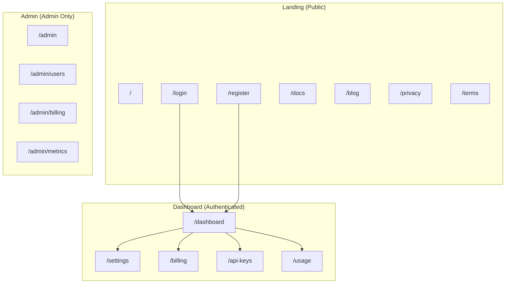
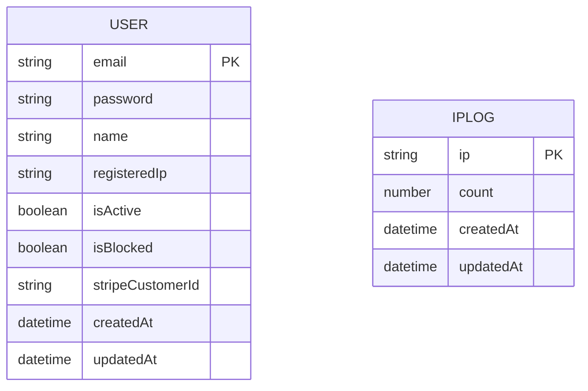
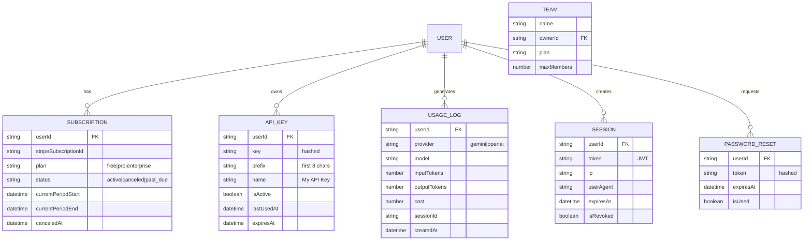
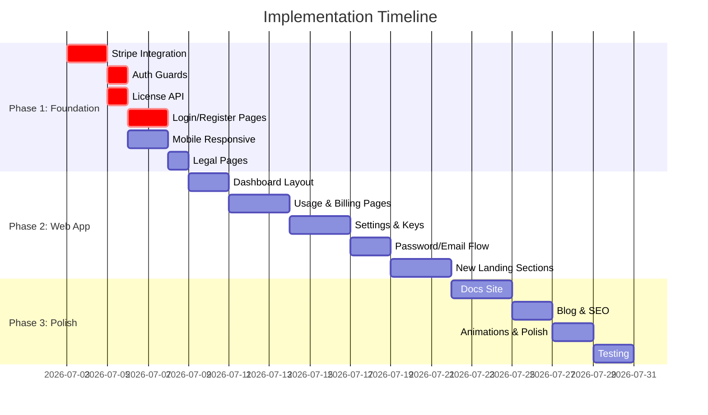

# 🌐 Landing + SaaS Web Application — Complete R&D

> **Purpose:** Landing page, SaaS backend, এবং পূর্ণাঙ্গ Web Application কী কী বানানো বাকি, কেমন design হবে, কীভাবে বানাতে হবে — সব এখানে
>
> **Last Updated:** 2026-07-02

---

## 📋 Table of Contents

1. [বর্তমানে যা আছে (Current State)](#1-বর্তমানে-যা-আছে)
2. [যা বাকি আছে (Missing Features)](#2-যা-বাকি-আছে)
3. [Landing Page — Full Plan](#3-landing-page--full-plan)
4. [SaaS Web Application — Full Plan](#4-saas-web-application--full-plan)
5. [SaaS Backend — Missing Implementations](#5-saas-backend--missing-implementations)
6. [Database Schema Expansion](#6-database-schema-expansion)
7. [Design System & Aesthetics](#7-design-system--aesthetics)
8. [Implementation Roadmap](#8-implementation-roadmap)

---

## 1. বর্তমানে যা আছে

### ✅ Landing Page (apps/landing/) — Next.js

| Page/Component | Status | Lines | কী আছে |
|----------------|--------|-------|---------|
| [page.tsx](file:///Volumes/SSD/0.1/istiyak_agent_v0.1/apps/landing/app/page.tsx) | ✅ Done | 300 | Nav, Hero, Features, Pricing (Free+Pro), Download, Footer, Modal |
| [Hero.tsx](file:///Volumes/SSD/0.1/istiyak_agent_v0.1/apps/landing/components/Hero.tsx) | ✅ Done | 29 | Gradient heading, badge, 2 CTAs |
| [Features.tsx](file:///Volumes/SSD/0.1/istiyak_agent_v0.1/apps/landing/components/Features.tsx) | ✅ Done | 45 | 4 feature cards (Execution, Watcher, BYOK, Sandbox) |
| [CheckoutButton.tsx](file:///Volumes/SSD/0.1/istiyak_agent_v0.1/apps/landing/components/CheckoutButton.tsx) | ⚠️ Stub | 11 | Button only, no Stripe integration |
| [layout.tsx](file:///Volumes/SSD/0.1/istiyak_agent_v0.1/apps/landing/app/layout.tsx) | ✅ Done | 27 | Fonts (Inter, Outfit, JetBrains Mono), SEO meta |
| [globals.css](file:///Volumes/SSD/0.1/istiyak_agent_v0.1/apps/landing/app/globals.css) | ✅ Done | 63 | .glow-btn, .card-glass, .card-glow-cyan, pulse-slow |
| [admin/page.tsx](file:///Volumes/SSD/0.1/istiyak_agent_v0.1/apps/landing/app/admin/page.tsx) | ✅ Done | 493 | User list, stats cards, block/unban |
| [success/page.tsx](file:///Volumes/SSD/0.1/istiyak_agent_v0.1/apps/landing/app/success/page.tsx) | ✅ Done | 128 | Payment success page |
| [cancel/page.tsx](file:///Volumes/SSD/0.1/istiyak_agent_v0.1/apps/landing/app/cancel/page.tsx) | ✅ Done | 108 | Payment cancel page |

### ✅ SaaS Backend (apps/saas-backend/) — Express

| Component | Status | কী আছে |
|-----------|--------|---------|
| Auth Routes | ✅ Done | Register, Login, Google OAuth, GitHub OAuth |
| Admin Routes | ⚠️ Basic | Only `GET /users` — user list |
| Billing Routes | ⚠️ Stub | `POST /checkout` exists but Stripe service is a mock |
| Sandbox Routes | ✅ Done | Create, Delete, Execute sandbox |
| Update Routes | ⚠️ Stub | Hardcoded version check |
| Passport Config | ✅ Done | Google + GitHub strategies |
| JWT Auth Middleware | ✅ Done | Token verification |
| Rate Limiter | ✅ Done | 30 req/min per IP |
| Error Handler | ✅ Done | Global error handler |

### ✅ Database (packages/database/)

| Model | Fields | Status |
|-------|--------|--------|
| **User** | email, password, name, registeredIp, isActive, isBlocked, stripeCustomerId | ✅ Done |
| **IpLog** | ip, count | ✅ Done |

---

## 2. যা বাকি আছে

### 🔴 Landing Page — Missing

| # | Feature | Priority | Details |
|---|---------|----------|---------|
| 1 | **Testimonials/Social Proof Section** | 🔴 HIGH | User quotes, company logos, stats (downloads, stars) |
| 2 | **Product Demo/Screenshot Section** | 🔴 HIGH | Desktop app screenshot/video, screen recordings |
| 3 | **How It Works Section** | 🔴 HIGH | 3-4 step visual flow (Install → Connect → Code → Ship) |
| 4 | **Comparison Table** | 🟡 MED | vs Cursor, vs GitHub Copilot, vs Windsurf, vs Aider |
| 5 | **FAQ Section** | 🟡 MED | Accordion-style Q&A (10-15 questions) |
| 6 | **Blog/Changelog Page** | 🟡 MED | `/blog`, `/changelog` routes |
| 7 | **Documentation Page** | 🔴 HIGH | `/docs` — setup guide, API reference |
| 8 | **Privacy Policy Page** | 🔴 HIGH | `/privacy` — GDPR-ready |
| 9 | **Terms of Service Page** | 🔴 HIGH | `/terms` — legal compliance |
| 10 | **Contact/Support Page** | 🟡 MED | `/contact` — email form or Discord link |
| 11 | **Animated Hero** | 🟡 MED | Terminal-like typing animation, code particles |
| 12 | **Mobile Responsive** | 🔴 HIGH | Current page lacks proper mobile breakpoints |
| 13 | **SEO Optimization** | 🟡 MED | og:image, structured data, sitemap.xml, robots.txt |
| 14 | **CheckoutButton Integration** | 🔴 HIGH | Currently a stub — needs real Stripe Checkout |
| 15 | **Cookie Consent Banner** | 🟡 MED | GDPR compliance |
| 16 | **Loading/Skeleton States** | 🟢 LOW | Page transition effects |

### 🔴 SaaS Backend — Missing

| # | Feature | Priority | Details |
|---|---------|----------|---------|
| 1 | **Real Stripe Integration** | 🔴 HIGH | `stripeService.ts` is a mock! No real checkout session |
| 2 | **Stripe Webhook Handler** | 🔴 HIGH | `checkout.session.completed`, `invoice.paid`, `customer.subscription.deleted` |
| 3 | **Subscription Management** | 🔴 HIGH | Upgrade, downgrade, cancel, reactivate |
| 4 | **User Profile API** | 🟡 MED | GET/PUT profile, avatar, preferences |
| 5 | **Usage Tracking API** | 🟡 MED | Token usage, cost per user, daily/weekly reports |
| 6 | **License Verification API** | 🔴 HIGH | Desktop app calls this to check Pro status |
| 7 | **API Key Management** | 🟡 MED | Generate, revoke, rotate API keys |
| 8 | **Email Verification** | 🟡 MED | Send verification link on register |
| 9 | **Password Reset** | 🟡 MED | Forgot password flow |
| 10 | **Admin Auth Guard** | 🔴 HIGH | Admin panel has NO authentication! Anyone can access `/admin` |
| 11 | **Webhook for Desktop Sync** | 🟡 MED | Push subscription status to desktop app |
| 12 | **Analytics/Metrics API** | 🟢 LOW | MRR, churn rate, DAU/MAU |
| 13 | **Team/Org Support** | 🟢 LOW | Team billing, shared workspace |

### 🔴 Web Application — Not Started

| # | Feature | Priority | Details |
|---|---------|----------|---------|
| 1 | **User Dashboard** | 🔴 HIGH | `/dashboard` — usage stats, subscription, API keys |
| 2 | **User Settings** | 🔴 HIGH | `/settings` — profile, password, billing |
| 3 | **Billing Portal** | 🔴 HIGH | `/billing` — invoices, payment method, plan change |
| 4 | **API Docs (Interactive)** | 🟡 MED | `/docs/api` — Swagger/OpenAPI style |
| 5 | **Onboarding Flow** | 🟡 MED | First-time user guided setup |
| 6 | **Login/Register Pages** | 🔴 HIGH | `/login`, `/register` — web forms |
| 7 | **Status Page** | 🟡 MED | `/status` — service health |

---

## 3. Landing Page — Full Plan

### 3.1 Complete Page Structure (Top to Bottom)

```
┌─────────────────────────────────────────────────┐
│  🔝 STICKY NAV                                   │
│  Logo | Features | Pricing | Docs | Download     │
│  [Login] [Download ↓]                            │
├─────────────────────────────────────────────────┤
│  🦸 HERO SECTION                                  │
│  Badge: "⚡ v0.1 — Now Available"                │
│  H1: "Your Autonomous AI Software Engineer"      │
│  Subtitle + 2 CTAs                               │
│  ✨ Animated terminal / code typing effect        │
├─────────────────────────────────────────────────┤
│  🏢 SOCIAL PROOF BAR                              │
│  "Trusted by 500+ developers"                    │
│  [GitHub Stars] [Downloads] [Discord Members]     │
├─────────────────────────────────────────────────┤
│  📸 PRODUCT DEMO SECTION                          │
│  Screenshot/Video of desktop app in action       │
│  Browser-frame mockup with actual UI             │
├─────────────────────────────────────────────────┤
│  🔧 HOW IT WORKS (3-Step Flow)                    │
│  1. Download & Install → 2. Connect IDE →         │
│  3. Let AI Code → Ship Faster                     │
├─────────────────────────────────────────────────┤
│  ⚡ FEATURES GRID (8 cards)                       │
│  Current 4 + 4 new:                              │
│  + RAG Search, Multi-LLM, Auto-Pilot, Git Ops   │
├─────────────────────────────────────────────────┤
│  📊 COMPARISON TABLE                              │
│  vs Cursor, vs Copilot, vs Windsurf, vs Aider    │
│  Feature checkmark grid                          │
├─────────────────────────────────────────────────┤
│  💰 PRICING SECTION (existing, enhanced)          │
│  Free + Pro + Enterprise (coming soon)           │
│  Monthly/Annual toggle                           │
├─────────────────────────────────────────────────┤
│  💬 TESTIMONIALS                                  │
│  3 developer quotes with avatars                 │
│  Carousel/grid layout                            │
├─────────────────────────────────────────────────┤
│  ❓ FAQ SECTION                                   │
│  10-15 accordion items                           │
│  Data security, BYOK, supported languages, etc.  │
├─────────────────────────────────────────────────┤
│  📥 DOWNLOAD SECTION (existing, enhanced)         │
│  Platform auto-detect, version info              │
│  macOS Intel/ARM, Windows, Linux                 │
├─────────────────────────────────────────────────┤
│  🏠 FOOTER                                       │
│  Product | Company | Legal | Social              │
│  Newsletter signup                               │
│  © 2026 ISTIYAK AI                               │
└─────────────────────────────────────────────────┘
```

### 3.2 New Routes Needed

| Route | Purpose | Priority |
|-------|---------|----------|
| `/` | Home (existing) | ✅ |
| `/admin` | Admin panel (existing) | ✅ |
| `/success` | Payment success (existing) | ✅ |
| `/cancel` | Payment cancel (existing) | ✅ |
| `/login` | 🆕 User login form | 🔴 HIGH |
| `/register` | 🆕 User registration | 🔴 HIGH |
| `/dashboard` | 🆕 User dashboard | 🔴 HIGH |
| `/settings` | 🆕 User settings | 🔴 HIGH |
| `/billing` | 🆕 Billing portal | 🔴 HIGH |
| `/docs` | 🆕 Documentation | 🔴 HIGH |
| `/docs/quickstart` | 🆕 Quick start guide | 🟡 MED |
| `/docs/api` | 🆕 API reference | 🟡 MED |
| `/blog` | 🆕 Blog/changelog | 🟡 MED |
| `/privacy` | 🆕 Privacy policy | 🔴 HIGH |
| `/terms` | 🆕 Terms of service | 🔴 HIGH |
| `/contact` | 🆕 Contact/support | 🟡 MED |
| `/status` | 🆕 Service status | 🟢 LOW |

### 3.3 New Components Needed

| Component | Purpose |
|-----------|---------|
| `SocialProof.tsx` | Stats bar (downloads, stars, users) |
| `ProductDemo.tsx` | Screenshot/video showcase |
| `HowItWorks.tsx` | 3-step visual flow |
| `ComparisonTable.tsx` | vs competitors feature grid |
| `Testimonials.tsx` | Developer quotes carousel |
| `FAQ.tsx` | Accordion Q&A section |
| `Footer.tsx` | Multi-column footer |
| `CookieConsent.tsx` | GDPR cookie banner |
| `Navbar.tsx` | Sticky nav with mobile hamburger |
| `AuthForm.tsx` | Login/Register forms |
| `DashboardLayout.tsx` | Dashboard sidebar + content |
| `UsageChart.tsx` | Token/cost usage chart |
| `BillingCard.tsx` | Current plan & invoice list |
| `SettingsForm.tsx` | Profile/password settings |

---

## 4. SaaS Web Application — Full Plan

### 4.1 Web App Architecture



### 4.2 User Dashboard Design (`/dashboard`)

```
┌──────────────────────────────────────────────────┐
│  SIDEBAR              │  MAIN CONTENT             │
│  ─────────            │                           │
│  📊 Overview          │  Welcome back, [User]     │
│  📈 Usage             │                           │
│  💳 Billing           │  ┌─── Stats Cards ──────┐ │
│  🔑 API Keys          │  │ Tokens  │ Cost │ Runs │ │
│  ⚙️ Settings          │  │ 245K   │ $1.2 │  38  │ │
│  📖 Docs              │  └────────────────────── │ │
│  🚪 Logout            │                           │
│                       │  ┌─── Usage Chart ──────┐ │
│                       │  │  📊 Daily token usage  │ │
│                       │  │  (bar chart, 7 days)   │ │
│                       │  └────────────────────── │ │
│                       │                           │
│                       │  ┌─── Recent Sessions ──┐ │
│                       │  │ Time │ Tokens │ Cost  │ │
│                       │  │ 2:30 │ 12.4K │ $0.02 │ │
│                       │  │ 1:15 │  8.2K │ $0.01 │ │
│                       │  └────────────────────── │ │
└──────────────────────────────────────────────────┘
```

### 4.3 Billing Portal Design (`/billing`)

```
┌─────────────────────────────────────────┐
│  Current Plan                            │
│  ┌─────────────────────────────────┐    │
│  │  🟢 PRO DEVELOPER — $19/month    │    │
│  │  Next billing: Aug 2, 2026       │    │
│  │  [Change Plan] [Cancel]          │    │
│  └─────────────────────────────────┘    │
│                                          │
│  Payment Method                          │
│  ┌─────────────────────────────────┐    │
│  │  💳 •••• 4242  Exp: 12/28       │    │
│  │  [Update Card]                   │    │
│  └─────────────────────────────────┘    │
│                                          │
│  Invoice History                         │
│  ┌─────────────────────────────────┐    │
│  │  Jul 2026 │ $19.00 │ ✅ Paid    │    │
│  │  Jun 2026 │ $19.00 │ ✅ Paid    │    │
│  │  May 2026 │ $19.00 │ ✅ Paid    │    │
│  └─────────────────────────────────┘    │
└─────────────────────────────────────────┘
```

### 4.4 Settings Page Design (`/settings`)

```
┌─────────────────────────────────────┐
│  Profile                             │
│  ├─ Name: [___________]             │
│  ├─ Email: user@example.com (🔒)    │
│  └─ [Save Changes]                  │
│                                      │
│  Security                            │
│  ├─ Change Password                  │
│  │  ├─ Current: [___________]       │
│  │  ├─ New:     [___________]       │
│  │  └─ [Update Password]            │
│  ├─ Two-Factor Auth: [Enable]       │
│  └─ Active Sessions: [View]         │
│                                      │
│  Connected Accounts                  │
│  ├─ 🟢 Google: connected@gmail.com  │
│  ├─ ⚪ GitHub: [Connect]            │
│  └─ Danger Zone                      │
│     └─ [Delete Account]             │
└─────────────────────────────────────┘
```

---

## 5. SaaS Backend — Missing Implementations

### 5.1 Stripe Integration (CRITICAL)

> [!CAUTION]
> `stripeService.ts` is currently a **MOCK** — it returns a fake session ID! Real billing will NOT work.

**কী বানাতে হবে:**

```typescript
// stripeService.ts — Real implementation needed
import Stripe from "stripe";

const stripe = new Stripe(process.env.STRIPE_SECRET_KEY!);

// 1. Create Checkout Session
export async function createCheckoutSession(userId: string, email: string) {
  return stripe.checkout.sessions.create({
    mode: "subscription",
    customer_email: email,
    line_items: [{ price: process.env.STRIPE_PRO_PRICE_ID, quantity: 1 }],
    success_url: `${process.env.FRONTEND_URL}/success?session_id={CHECKOUT_SESSION_ID}`,
    cancel_url: `${process.env.FRONTEND_URL}/cancel`,
    metadata: { userId },
  });
}

// 2. Webhook Handler — MISSING ENTIRELY
// POST /api/billing/webhook
// Events to handle:
//   - checkout.session.completed → activate Pro
//   - invoice.paid → renew subscription
//   - invoice.payment_failed → send warning
//   - customer.subscription.deleted → deactivate Pro
//   - customer.subscription.updated → plan change

// 3. Customer Portal — MISSING
// POST /api/billing/portal → returns Stripe billing portal URL

// 4. Subscription Status — MISSING
// GET /api/billing/status → current plan, next billing date
```

### 5.2 Missing API Endpoints

| Endpoint | Method | Purpose | Status |
|----------|--------|---------|--------|
| `POST /api/billing/webhook` | POST | Stripe webhook | ❌ Missing |
| `POST /api/billing/portal` | POST | Billing portal URL | ❌ Missing |
| `GET /api/billing/status` | GET | Subscription status | ❌ Missing |
| `GET /api/auth/profile` | GET | User profile | ❌ Missing |
| `PUT /api/auth/profile` | PUT | Update profile | ❌ Missing |
| `POST /api/auth/forgot-password` | POST | Password reset | ❌ Missing |
| `POST /api/auth/reset-password` | POST | Reset with token | ❌ Missing |
| `POST /api/auth/verify-email` | POST | Email verification | ❌ Missing |
| `GET /api/auth/verify/:token` | GET | Confirm email | ❌ Missing |
| `GET /api/license/check` | GET | License verification | ❌ Missing |
| `POST /api/keys/generate` | POST | Generate API key | ❌ Missing |
| `DELETE /api/keys/:keyId` | DELETE | Revoke API key | ❌ Missing |
| `GET /api/usage/daily` | GET | Daily usage stats | ❌ Missing |
| `GET /api/usage/summary` | GET | Usage summary | ❌ Missing |
| `GET /api/admin/metrics` | GET | Admin metrics | ❌ Missing |
| `POST /api/admin/user/block` | POST | Block user | ⚠️ Frontend only |
| `POST /api/admin/user/unblock` | POST | Unblock user | ⚠️ Frontend only |

### 5.3 Security Gaps

> [!WARNING]
> **Critical security issues in current implementation:**

| # | Issue | Severity | Fix |
|---|-------|----------|-----|
| 1 | **Admin page has NO auth** | 🔴 CRITICAL | Add admin role + JWT guard |
| 2 | **Admin API has NO auth** | 🔴 CRITICAL | `GET /api/admin/users` is open! |
| 3 | **Billing POST has NO auth** | 🔴 HIGH | `POST /api/billing/checkout` — anyone can create sessions |
| 4 | **Sandbox create has NO auth** | 🔴 HIGH | `POST /api/sandbox/create` — open endpoint |
| 5 | **No CSRF protection** | 🟡 MED | Add CSRF tokens for forms |
| 6 | **Rate limiter not on all routes** | 🟡 MED | Only middleware, not applied to all routes |
| 7 | **No password hashing visible** | 🟡 MED | `authService.ts` uses bcrypt but verify flow |
| 8 | **Hardcoded `localhost:3002` in admin** | 🟡 MED | Should use env var |

---

## 6. Database Schema Expansion

### Current Models (2)



### Needed Models (+6)



---

## 7. Design System & Aesthetics

### 7.1 Current Design Language

| Element | Value |
|---------|-------|
| **Primary Background** | `#030712` (near-black) / `#07080d` |
| **Card Background** | `#12141c` |
| **Primary Accent** | `#06b6d4` (Cyan-500) |
| **Success** | `#10b981` (Emerald-500) |
| **Error** | `#ef4444` (Red-500) |
| **Text Primary** | `#f3f4f6` (Gray-100) |
| **Text Secondary** | `#9ca3af` (Gray-400) |
| **Heading Font** | Outfit (800 bold) |
| **Body Font** | Inter (400-600) |
| **Code Font** | JetBrains Mono |
| **Border** | `rgba(255,255,255,0.05-0.1)` |
| **Glass Effect** | `backdrop-filter: blur(12px)` |
| **Glow Button** | `linear-gradient(135deg, #06b6d4, #3b82f6)` + box-shadow |

### 7.2 Design Improvements Needed

| # | Issue | Solution |
|---|-------|----------|
| 1 | **No mobile responsiveness** | Add breakpoints (@media), hamburger nav |
| 2 | **Inline styles everywhere** | Migrate to CSS modules or Tailwind classes |
| 3 | **No animations** | Add scroll-triggered reveals (Intersection Observer) |
| 4 | **No dark/light toggle** | Keep dark only (brand identity) |
| 5 | **No skeleton loading** | Add pulse/shimmer loading states |
| 6 | **Static hero** | Add animated terminal or code typing effect |
| 7 | **No hover effects on cards** | Add scale/glow on hover |
| 8 | **Pricing cards look same** | Make Pro card visually distinct (glow border, "Popular" badge) |
| 9 | **No favicon/OG image** | Add favicon.ico, og:image for social sharing |
| 10 | **CheckoutButton disconnected** | Wire to real Stripe via SaaS backend |

### 7.3 Design Vision — Web App Dashboard

**Theme:** Developer-native dark glass UI — similar to Vercel Dashboard / Linear App

```
Color Tokens:
  --bg-primary:       #030712
  --bg-secondary:     #0f1117
  --bg-card:          rgba(17, 24, 39, 0.7)
  --bg-card-hover:    rgba(17, 24, 39, 0.9)
  --border:           rgba(255, 255, 255, 0.06)
  --border-hover:     rgba(6, 182, 212, 0.3)
  --accent:           #06b6d4
  --accent-glow:      rgba(6, 182, 212, 0.4)
  --success:          #10b981
  --warning:          #f59e0b
  --danger:           #ef4444
  --text-primary:     #f3f4f6
  --text-secondary:   #9ca3af
  --text-muted:       #6b7280

Typography:
  Headings:  Outfit, 700-800
  Body:      Inter, 400-600
  Code:      JetBrains Mono, 400
  Sizes:     12px (xs) → 14px (sm) → 16px (base) → 20px (lg) → 24px (xl) → 32px (2xl)

Spacing:
  4px → 8px → 12px → 16px → 24px → 32px → 48px → 64px

Border Radius:
  Cards: 16px
  Buttons: 8-10px
  Avatars: 50%
  Input: 8px

Shadows:
  Cards:   0 20px 25px -5px rgba(0,0,0,0.3)
  Modals:  0 25px 50px -12px rgba(0,0,0,0.6)
  Glow:    0 0 20px rgba(6,182,212,0.4)
```

---

## 8. Implementation Roadmap

### Phase 1: Foundation (Week 1-2) 🔴 CRITICAL

> Core functionality that blocks everything else

| Task | Files Affected | Est. Hours |
|------|---------------|------------|
| Real Stripe integration | `stripeService.ts`, new `webhook.ts` | 8h |
| Auth guards on admin + billing | `admin.ts`, `billing.ts`, `middleware/auth.ts` | 4h |
| License verification API | New `license.ts` route + controller | 4h |
| Login/Register web pages | New `/login`, `/register` routes | 6h |
| User profile API | New profile controller | 4h |
| Mobile responsive landing | `page.tsx`, `globals.css`, all components | 8h |
| Privacy + Terms pages | New `/privacy`, `/terms` routes | 3h |

**Estimated: ~37 hours**

---

### Phase 2: Web Application (Week 3-4) 🟡 IMPORTANT

> User-facing dashboard and billing portal

| Task | Files Affected | Est. Hours |
|------|---------------|------------|
| Dashboard layout + sidebar | New `DashboardLayout.tsx` | 6h |
| Usage stats page | New `/dashboard` + usage API | 8h |
| Billing portal page | New `/billing` + Stripe portal API | 6h |
| Settings page | New `/settings` + profile update API | 6h |
| API key management | New `/api-keys` route + model + API | 6h |
| Password reset flow | New reset API + email template | 6h |
| Email verification | New verify API + email sending | 4h |
| Database schema expansion | 4-5 new Mongoose models | 4h |
| New landing sections | SocialProof, HowItWorks, FAQ, Testimonials | 12h |

**Estimated: ~58 hours**

---

### Phase 3: Polish & Scale (Week 5-6) 🟢 NICE-TO-HAVE

> Final polish, SEO, docs, and nice-to-have features

| Task | Files Affected | Est. Hours |
|------|---------------|------------|
| Comparison table section | New `ComparisonTable.tsx` | 4h |
| Documentation site | New `/docs/*` routes | 12h |
| Blog/changelog | New `/blog` route | 8h |
| SEO optimization | sitemap, robots.txt, og:image | 4h |
| Animated hero | Framer Motion / CSS animations | 6h |
| Cookie consent | New `CookieConsent.tsx` | 2h |
| Admin panel enhancement | Metrics, billing overview, search | 8h |
| Contact/support page | New `/contact` route | 3h |
| Status page | New `/status` route | 3h |
| End-to-end testing | Playwright tests | 8h |

**Estimated: ~58 hours**

---

### Total Estimated: ~153 hours (4-6 weeks)



---

> [!TIP]
> **শুরু করার আগে Phase 1 এর Stripe integration এবং admin auth guard ফিক্স করা সবচেয়ে জরুরি — এগুলো security critical!**

> [!IMPORTANT]
> **এই R&D ডকুমেন্ট approve করলে আমি সরাসরি বানানো শুরু করতে পারি। কোন Phase দিয়ে শুরু করতে চান বলুন!**
