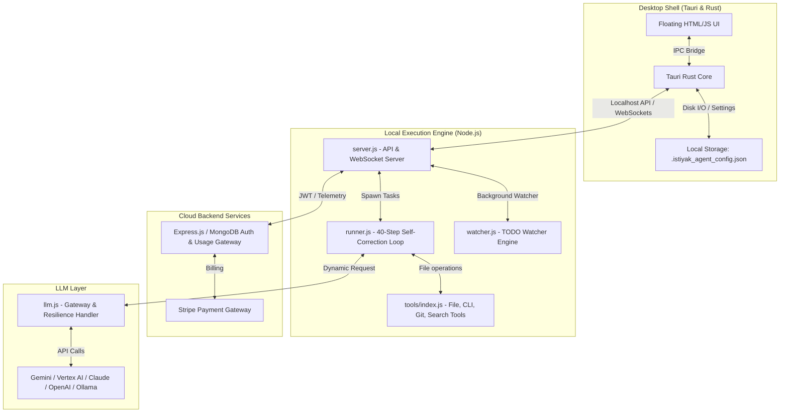
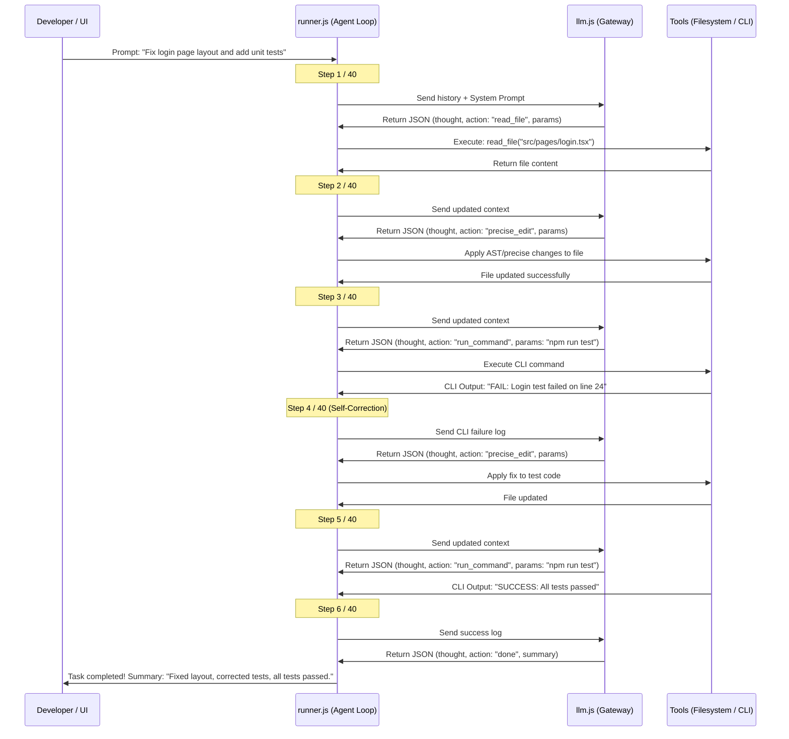

# 🚀 ISTIYAK AI COMPANION — MASTER BUSINESS & ARCHITECTURAL BLUEPRINT
## Core Architecture, MVP Execution Phases, and AI Agent Onboarding Guide
**Version:** 1.0.0-PRO  
**Author:** Antigravity (AI System Architect) & Istiyak (Founder)

---

## 1. Executive Summary & Business Vision
The **ISTIYAK AI Companion** is a standalone, lightweight, floating desktop application designed to act as an autonomous AI software engineer. Instead of building a heavy, bloated, custom IDE (like Cursor or VS Code), this companion runs alongside the developer's existing IDE (VS Code, Cursor, JetBrains, Vim) to monitor workspaces, execute background tasks, build features, and fix bugs autonomously.

### Business Model & Go-To-Market (GTM)
1. **Target Audience:** Freelancers, Indie Hackers, Enterprise Software Engineers, and agency developers looking to double their velocity without switching code editors.
2. **Freemium Tier:** Free users get access to basic chat and standard open-source models with strict daily API rate limits.
3. **Pro/Enterprise Tier (Stripe SaaS Integration):** Paid users unlock premium models (e.g., Gemini 1.5/2.5 Pro, Claude 3.5 Sonnet, GPT-4o) with longer token limits, advanced auto-planning (up to 40 steps), cloud-sandboxed executions, and dynamic background code completion.
4. **Value Proposition:** Pure speed, zero-context-switching, low memory usage, and highly resilient autonomous execution.

---

## 2. Core Architecture (The Brain & Body)

The application separates UI presentation from execution logic to guarantee extreme performance, low memory overhead, and resilience.



### Component Details
*   **Desktop Shell (Tauri + Rust):**
    *   Creates a borderless, transparent, floating widget window (`alwaysOnTop: true`, `decorations: false`, `transparent: true`, `rounded: 18px`).
    *   Provides secure, native OS interactions and manages local configurations (`.istiyak_agent_config.json`) so no sensitive keys are stored in insecure frontend states.
*   **Local Execution Engine (Node.js/Express):**
    *   Runs a local daemon to handle computationally heavy operations, file watching, and shell executions.
    *   `runner.js`: The autonomous execution loop (40-step limit).
    *   `watcher.js`: Passive background agent monitoring code workspace directories. (Deferred to post-release to speed up MVP).
*   **LLM Gateway (`llm.js`):**
    *   Standardizes diverse LLM providers into a single unified prompt/response interface.
    *   Handles retry logic and rate limits (e.g., HTTP 429 backoff) automatically.
    *   Integrates `costTracker.js` to parse input/output tokens and calculate live costs based on model-specific rates.

---

## 3. Dynamic LLM Settings & Provider System

To operate as a successful business, the app must support both user-provided API keys (BYOK) and server-billed credits.

### Supported Providers & Models
1.  **Gemini (Google AI Studio / Vertex AI):**
    *   *Models:* Gemini 2.5 Flash, Gemini 2.5 Pro, Gemini 2.0 Flash, Gemini 1.5 Pro, Custom Model.
    *   *Service Account:* When Service Account JSON mode is chosen, the UI requires GCP Project ID and Vertex Region (recommended region for Gemini 3.x is `global`; other options include `us-central1`, `us-east4`, `europe-west4`, `asia-southeast1`).
2.  **OpenAI:** For GPT-4o, GPT-4-turbo, and compatible custom models.
3.  **Anthropic (Claude):** Claude 3.5 Sonnet for precise refactoring and coding.
4.  **DeepSeek & Ollama:** For local execution, offline development, or cheap processing.
5.  **Custom Provider / Endpoint:** Allows enterprise customers to connect internal LLM proxy systems.

### Authentication Modes & UI Fields
*   **API Key Mode:** Displays API Key input, LLM Model dropdown, Workspace selector, and Google Search toggle.
*   **Service Account JSON Mode:** Displays JSON file selector, GCP Project ID, Vertex Region, LLM Model dropdown, Workspace selector, and Google Search toggle.
*   **Custom Model Handling:** If "Custom Model" is selected, dynamically show an input field for `Custom Model Name`. If no model is found, display: *"No model found, please enter your custom model name."*

### ADK Architecture & Agent Tools
*   **ADK Architecture:**
    `root_agent` ──> `google_search_agent` & `url_context_agent`
*   **Available Tools:**
    *   `GoogleSearchTool` (Toggle ON enables web search capabilities)
    *   `UrlContextTool` (Used to retrieve context from provided web URLs)

### Zustand State Schema
The settings store (implemented via Zustand and synced to disk) manages configurations dynamically:

```typescript
interface SettingsState {
  provider: 'gemini' | 'openai' | 'claude' | 'ollama' | 'custom';
  authMethod: 'apiKey' | 'serviceAccount';
  apiKey: string;
  serviceAccountPath: string; // Absolute path to key.json (Never committed to Git!)
  projectId: string;          // GCP Project ID
  location: string;           // Vertex Region (e.g. 'global', 'us-central1')
  selectedModel: string;
  customModel: string;        // Store custom model name
  workspacePath: string;      // Current directory being monitored / modified
  googleSearchEnabled: boolean;
}
```

*   **Security Rule:** To protect users, the system must add `credentials/`, `*.json`, and `.env` to the default `.gitignore` of any initialized workspace. Never store `private_key`, `private_key_id`, access tokens, or refresh tokens in plaintext.

---

## 4. The Autonomous Execution Engine (`runner.js`)

The differentiator of the Pro version is the agent's ability to solve complex, multi-step tasks without human hand-holding.



### Self-Correction & Safety Constraints
1.  **Task Classification:**
    *   *Quick Tasks:* Small syntax adjustments are done directly using `precise_edit` or `ast_edit`.
    *   *Medium/Large Tasks:* The agent creates a `workspace_plan.md`, waits for user approval, and then proceeds.
2.  **Context Compression:** When step counts approach 20+, the agent summarizes early steps to reduce token costs and prevent LLM context-window exhaustion.
3.  **Maximum Step Count:** Capped at **40 steps** to prevent infinite loops and runaway API costs.

---

## 5. MVP RELEASE EXECUTION PHASES (Action Plan to Launch)

To speed up time-to-market, the release phases are optimized. Feature creep must be strictly avoided.

### Phase 1: Foundation & Floating UI Setup (✅ Done)
*   [x] Initialize Tauri project with React and TypeScript.
*   [x] Configure Tailwind CSS with Dark Cinematic Theme.
*   [x] Set Tauri window settings: `alwaysOnTop: true`, `decorations: false`, `transparent: true`.
*   [x] Build Chat UI (Input, Message List).
*   [x] Implement Rust backend commands `load_config` and `save_config` for local secure settings.

### Phase 2: Agent Core Integration (✅ Done)
*   [x] Connect Zustand `settingsStore` to UI dropdowns (Provider, Model, location settings).
*   [x] Implement Vercel AI SDK streaming in the frontend.
*   [x] Hook up `llm.js` for dynamic API routing based on the selected provider.
*   [x] Integrate `runner.js` to enable the 40-step execution loop from the chat UI.
*   [x] Connect `costTracker.js` to show active session cost in the UI.

### Phase 3: Rust Filesystem & Tools Layer (✅ Done)
*   [x] Create Tauri Rust commands for `read_file`, `write_file` (overwrites entire file content), and `scan_project`.
*   [x] Map these Rust commands to the `tools/index.js` layer so `runner.js` can trigger them.
*   [x] Implement a safe `run_command` via Node.js `child_process` (Docker sandbox pushed to Post-Release).

### Phase 4: Security, Auth & Abuse Prevention (✅ Done)
*   [x] Setup Express.js + MongoDB backend.
*   [x] Implement simple Email + Password JWT authentication.
*   [x] **Crucial Anti-Abuse:** Implement IP Fingerprinting in the Gateway. Rule: Block IP if multiple free accounts are generated.
*   [x] Force free-tier users to cost-effective models (e.g. Gemini Flash) and enforce strict usage limits.
*   [x] Setup `isActive: true` / `isBlocked: true` flags in the MongoDB user schema.

> [!NOTE]
> **Developer Note on Auth Gatekeeping (Restored for Production):**
> Originally, Phase 4 auth gatekeeping was made non-blocking for local development. We have now restored the strict `!token` check. If no session token is stored, the companion displays a full-viewport blocking overlay requiring authentication, hiding the close button and ignoring backdrop clicks.


### Phase 5: Launch Infrastructure & GTM (✅ Completed)
*   [x] Scaffold Next.js Landing Page showcasing the AI Companion.
*   [x] Integrate Stripe for Pro/Premium plan upgrades.
*   [x] Configure GitHub Actions to auto-build installers:
    *   *macOS:* `.dmg` & `.app` (Apple Silicon & Intel)
    *   *Windows:* `.exe` & `.msi`
    *   *Linux:* `.AppImage` & `.deb`
*   [x] Setup basic Admin Dashboard to view active users and ban abusers instantly.
*   [x] Tauri OTA update integration.
*   [x] Integrated Sentry monitoring on client and server.

---

## 6. Post-Release Scaling Roadmap (Deferred Features)
These features are confirmed for the architecture:
1.  **Background Watcher Mode (`watcher.js`):** (✅ Completed) Auto-detecting `// TODO:` comments in `.js`, `.ts`, `.tsx`, `.py`, `.cpp`, `.cs`, `.net` files with dynamic file locking.
2.  **Cloud Docker Sandboxing:** (✅ Completed) Advanced cloud terminal execution (moving from local CLI to secure, cloud-based DinD containers).
3.  **Full IDE UI:** (✅ Completed) Monaco Editor, built-in terminal panels, file explorer.
4.  **Marketplace:** (✅ Completed) Extension SDK, custom themes, and prompts.
5.  **OAuth Logins:** (✅ Completed) Google/GitHub logins integrated into SaaS gateway and local desktop sync.
6.  **Semantic RAG, Git Autopilot & Context Caching:** (✅ Completed) Codebase vector-based similarity fallback crawler, auto-injection context triggers, and branch/commit Git tools.
7.  **Multi-Model Orchestration, Live Telemetry & Auto-Diagnosis:** (✅ Completed) Message keyword classification router, cost/latency telemetry dashboard, and terminal error auto-diagnosis hotkey.


---

## 7. Strict Launch & Safety Rules
1.  **No feature creeping:** If a feature is not in Phases 1-5, it must be pushed to Post-Release.
2.  **Never write partial files:** The AI must always rewrite the full file or use precise AST edits to prevent code breaking.
3.  **Always ask before large actions:** The AI must require user approval before generating large plans or deleting files.

---

## 8. Developer/Agent Onboarding Guidelines
> [!IMPORTANT]
> When onboarding a new AI Developer Agent to this codebase, the agent MUST:
> 1. Read `.istiyak_agent_config.json` (if present) to understand user settings.
> 2. Ensure all file edits maintain compatibility with Tauri's command dispatch protocol.
> 3. Verify security guidelines: Never write credentials directly to code files, and always append them to the default `.gitignore`.
> 4. Test code changes using mock LLM responses in the local test suite before pushing changes.
