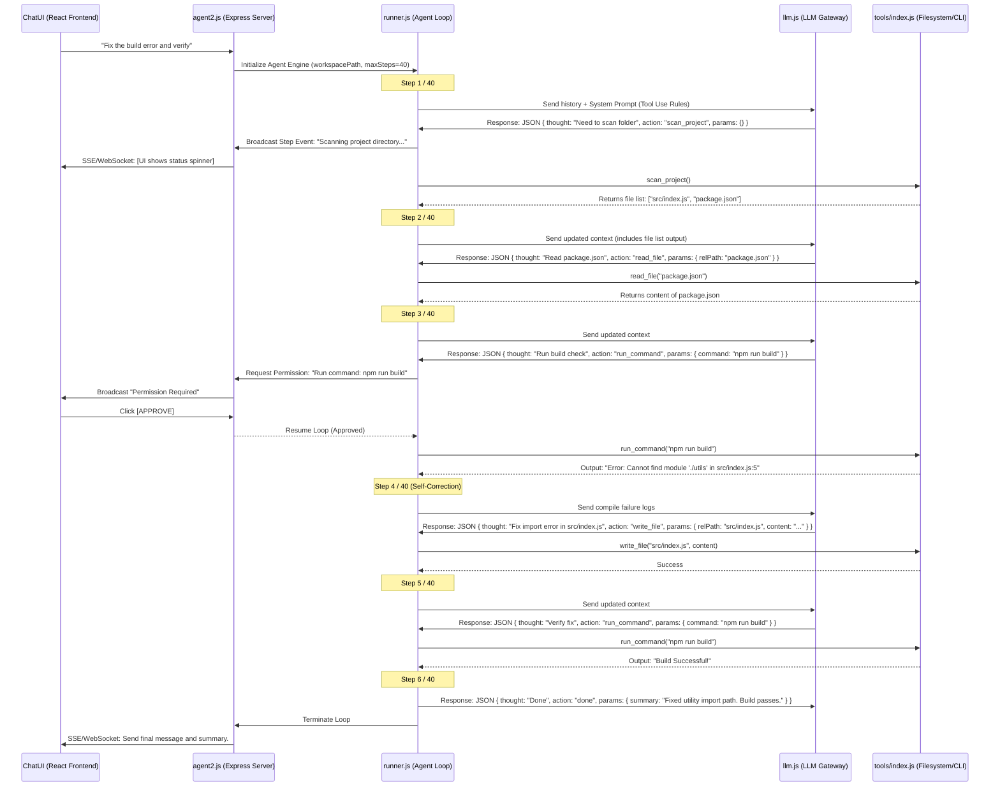

# 🤖 AUTONOMOUS AGENT ENGINE (CURSOR-STYLE LOOP) — TECHNICAL RND SPECIFICATION
**প্রজেক্ট:** ISTIYAK AI Companion (v0.2.0-Agent-RND)  
**উদ্দেশ্য:** ওয়ান-টার্ন চ্যাটকে একটি সম্পূর্ণ স্বায়ত্তশাসিত (Autonomous), মাল্টি-স্টেপ সেলফ-কারেক্টিং এজেন্টে রূপান্তর করা।  
**ভাষা:** বাংলা (নির্দেশিকা ও ব্যাখ্যা) + English (Technical Code Blueprints & Specs)

---

## ১. প্রজেক্টের কাজের পরিধি ও আর্কিটেকচার (System Architecture)

একটি সাধারণ চ্যাট জিপিটি চ্যাট শুধুমাত্র মেসেজ আদান-প্রদান করে। কিন্তু একটি **"Cursor Agent"** বা **"Devin-style Agent"** ব্যাকগ্রাউন্ডে একটি লুপ চালায়। এই লুপের মাধ্যমে এআই নিজে সিদ্ধান্ত নিয়ে প্রজেক্ট ডিরেক্টরি রিড করে, কোড মডিফাই করে, টার্মিনালে রান করে এবং এরর ফিক্স করে।

### এজেন্ট লুপের সিকোয়েন্স ডায়াগ্রাম (Sequence Flow):



---

## ২. এআই প্রম্পট ও টুল স্পেসিফিকেশন (LLM System Prompt & Tool Schema)

এজেন্টকে স্বয়ংক্রিয়ভাবে কাজ করানোর জন্য সবচেয়ে গুরুত্বপূর্ণ হলো **System Prompt**। এআই-কে বাধ্য করতে হবে যাতে সে কোনো অপ্রয়োজনীয় বকবক না করে শুধুমাত্র একটি নির্দিষ্ট **JSON ফরম্যাটে** উত্তর দেয়।

### System Prompt Blueprint:
```javascript
export const AGENT_SYSTEM_PROMPT = `
You are ISTIYAK AGENT, an autonomous senior software engineering expert. 
Your goal is to solve the user's task step-by-step by utilizing the tools provided.

At each step, you must think and determine the next action. You can use one tool per turn.
Your response MUST be a valid JSON object matching the following TypeScript schema:

interface AgentResponse {
  thought: string; // Detail your step-by-step thinking process and analysis of the current state.
  action: 'scan_project' | 'read_file' | 'write_file' | 'run_command' | 'search_workspace' | 'git_checkout_branch' | 'git_commit_changes' | 'done';
  params: {
    relPath?: string;      // Required for read_file, write_file
    content?: string;      // Required for write_file (always write the COMPLETE, working file content, never placeholders)
    command?: string;      // Required for run_command
    query?: string;        // Required for search_workspace
    branchName?: string;   // Required for git_checkout_branch
    createNew?: boolean;   // Optional for git_checkout_branch
    message?: string;      // Required for git_commit_changes
    summary?: string;      // Required for done
  };
}

CRITICAL RULES:
1. ONLY output the raw JSON object. Do not wrap it in markdown codeblocks except standard JSON. Do not write text outside the JSON.
2. Before modifying files, you should read them using read_file.
3. If a command execution returns an error, examine the error message carefully and fix the files using write_file in the next steps.
4. When you are confident the task is successfully resolved (and verified via tests/builds if possible), set action to "done".
5. Never write partial files, draft edits, or comments like "// rest of code goes here". Always write the entire file cleanly.
`;
```

---

## ৩. এজেন্ট রানার কোড ডিজাইন (`engine/runner.js` Blueprint)

আমাদেরকে `engine/runner.js` ফাইলটি পুনরায় লিখতে হবে যাতে এটি একটি স্বায়ত্তশাসিত লুপ রান করতে পারে। নিচে এর একটি পূর্ণাঙ্গ কোড ব্লুপ্রিন্ট দেওয়া হলো:

```javascript
// engine/runner.js (Autonomous Agent Core Loop)
import { streamLLM } from "./llm.js";
import { tools } from "./tools/index.js";
import { estimateTokens, calculateCost } from "./costTracker.js";

const MAX_STEPS = 40;

/**
 * Helper to safely extract JSON from LLM response.
 * Handles cases where LLM wraps JSON in markdown blocks (e.g. ```json ... ```).
 */
function parseAgentResponse(rawText) {
  try {
    let cleanText = rawText.trim();
    if (cleanText.startsWith("```json")) {
      cleanText = cleanText.substring(7);
    } else if (cleanText.startsWith("```")) {
      cleanText = cleanText.substring(3);
    }
    if (cleanText.endsWith("```")) {
      cleanText = cleanText.substring(0, cleanText.length - 3);
    }
    return JSON.parse(cleanText.trim());
  } catch (err) {
    throw new Error(`Failed to parse agent JSON. Raw response: ${rawText}`);
  }
}

/**
 * Main Autonomous Agent execution loop.
 */
export async function runAgent(
  messages,
  provider,
  model,
  authMethod,
  apiKey,
  serviceAccountPath,
  projectId,
  location,
  workspacePath,
  googleSearchEnabled,
  broadcastEvent // Callback to stream current steps to UI
) {
  // 1. Initialize execution messages history
  const agentHistory = [
    { role: "system", content: AGENT_SYSTEM_PROMPT },
    ...messages
  ];

  let inputTokensTotal = 0;
  let outputTokensTotal = 0;

  broadcastEvent({ type: "init", message: "Autonomous Agent initialized." });

  // 2. Start Multi-Step Agent Loop
  for (let step = 1; step <= MAX_STEPS; step++) {
    broadcastEvent({ type: "status", step, message: "Asking AI for next step..." });

    // Request LLM decision
    let llmResponse = "";
    try {
      llmResponse = await streamLLM(
        agentHistory,
        provider,
        model,
        authMethod,
        apiKey,
        serviceAccountPath,
        projectId,
        location,
        (chunk) => {
          // Stream raw thoughts to UI if needed
        }
      );
    } catch (err) {
      broadcastEvent({ type: "error", message: `LLM Call failed: ${err.message}` });
      throw err;
    }

    inputTokensTotal += estimateTokens(JSON.stringify(agentHistory));
    outputTokensTotal += estimateTokens(llmResponse);

    // Save AI decision in history
    agentHistory.push({ role: "assistant", content: llmResponse });

    // Parse JSON Thought/Action
    let parsedDecision;
    try {
      parsedDecision = parseAgentResponse(llmResponse);
    } catch (parseErr) {
      // Feed error back to LLM to self-correct JSON formatting
      const errorMsg = `Error: Your response was not a valid JSON. Please repeat the instruction and output strict JSON only. Details: ${parseErr.message}`;
      agentHistory.push({ role: "user", content: errorMsg });
      broadcastEvent({ type: "warning", message: "AI sent invalid JSON. Retrying with correction prompt..." });
      continue; 
    }

    const { thought, action, params } = parsedDecision;
    broadcastEvent({ type: "thought", step, thought });

    // Stop condition
    if (action === "done") {
      broadcastEvent({ type: "done", message: params.summary || "Task finished successfully!" });
      return {
        success: true,
        summary: params.summary,
        inputTokens: inputTokensTotal,
        outputTokens: outputTokensTotal,
        cost: calculateCost(provider, inputTokensTotal, outputTokensTotal)
      };
    }

    // Execute Tool Action
    let toolResult = "";
    broadcastEvent({ type: "action", step, action, params });

    try {
      if (action === "scan_project") {
        const files = await tools.scan_project(workspacePath);
        toolResult = `scan_project output: Verified project files list: ${JSON.stringify(files)}`;
      } 
      else if (action === "read_file") {
        const fileContent = await tools.read_file(workspacePath, params.relPath);
        toolResult = `read_file [${params.relPath}] output:\n${fileContent}`;
      } 
      else if (action === "write_file") {
        // Safe lock checking is already handled in tools.write_file
        await tools.write_file(workspacePath, params.relPath, params.content);
        toolResult = `write_file [${params.relPath}] output: File updated successfully.`;
      } 
      else if (action === "run_command") {
        // Human-in-the-loop: ask Express to block until UI grants permission
        const approved = await broadcastEvent({ type: "permission_required", command: params.command });
        if (!approved) {
          toolResult = `run_command [${params.command}] output: Execution blocked by developer. You must try another method.`;
        } else {
          const cliOutput = await tools.run_command(workspacePath, params.command);
          toolResult = `run_command [${params.command}] output:\n${cliOutput}`;
        }
      } 
      else if (action === "search_workspace") {
        const searchMatches = await tools.search_workspace(workspacePath, params.query);
        toolResult = `search_workspace output: Found references: ${JSON.stringify(searchMatches)}`;
      } 
      else if (action === "git_checkout_branch") {
        const gitOutput = await tools.git_checkout_branch(workspacePath, params.branchName, params.createNew);
        toolResult = `git_checkout_branch output: ${gitOutput}`;
      } 
      else if (action === "git_commit_changes") {
        const gitOutput = await tools.git_commit_changes(workspacePath, params.message);
        toolResult = `git_commit_changes output: ${gitOutput}`;
      } 
      else {
        toolResult = `Error: Unknown tool action '${action}'. Please use valid actions.`;
      }
    } catch (toolErr) {
      toolResult = `Action [${action}] failed with error: ${toolErr.message}`;
      broadcastEvent({ type: "tool_error", message: toolResult });
    }

    // Feed tool results back to LLM to take the next step
    agentHistory.push({
      role: "user",
      content: `[System Tool Response for Step ${step}]\n${toolResult}`
    });
  }

  // If loop completes without "done", return failure
  broadcastEvent({ type: "error", message: `Max step limit (${MAX_STEPS}) exceeded.` });
  return {
    success: false,
    message: "Max step count reached without resolution."
  };
}
export const AGENT_SYSTEM_PROMPT = `...`;
```

---

## ৪. লাইভ স্ট্রিমিং ও এপ্রুভাল গেটওয়ে (`engine/agent2.js` Specification)

এজেন্ট যখন কোনো দীর্ঘ কাজ করে, ইউজারের চ্যাট স্ক্রিনে প্রতি সেকেন্ডের অগ্রগতি (Progress) লাইভ দেখতে পাওয়া দরকার। এ জন্য Express-এ **Server-Sent Events (SSE)** সেটআপ করার ব্লুপ্রিন্ট:

```javascript
// Express route for SSE Agent Streaming
app.post("/api/chat-agent", (req, res) => {
  res.setHeader("Content-Type", "text/event-stream");
  res.setHeader("Cache-Control", "no-cache");
  res.setHeader("Connection", "keep-alive");

  const { messages, workspacePath, provider, model, apiKey } = req.body;

  // Setup active request mapping to allow pause/resume for human authorization
  const requestId = Date.now().toString();

  const broadcastEvent = async (event) => {
    // Send event to client
    res.write(`data: ${JSON.stringify(event)}\n\n`);

    if (event.type === "permission_required") {
      // Block Javascript loop execution until developer approves via a separate endpoint
      return new Promise((resolve) => {
        app.locals[requestId] = { resolve };
      });
    }
    return true;
  };

  runAgent(
    messages,
    provider,
    model,
    "apiKey",
    apiKey,
    null, null, null,
    workspacePath,
    false,
    broadcastEvent
  ).then((result) => {
    res.write(`data: ${JSON.stringify({ type: "complete", result })}\n\n`);
    res.end();
  }).catch((err) => {
    res.write(`data: ${JSON.stringify({ type: "fatal", error: err.message })}\n\n`);
    res.end();
  });
});

// Endpoint to approve blocked command execution
app.post("/api/agent/approve", (req, res) => {
  const { requestId, approved } = req.body;
  const pending = app.locals[requestId];
  if (pending) {
    pending.resolve(approved); // Resolve the blocked promise in runAgent
    delete app.locals[requestId];
    res.json({ success: true });
  } else {
    res.status(404).json({ error: "No pending approval request found." });
  }
});
```

---

## ৫. ফ্রন্টএন্ড উইজেট রি-ডিজাইন (`ChatUI.tsx` Blueprint)

ফ্রন্টএন্ডে এজেন্টের লাইভ কার্যকলাপ দেখানোর জন্য React-এর স্টেট হ্যান্ডলিং পরিবর্তন করতে হবে।

### চ্যাটের ভেতর লাইভ অ্যাক্টিভিটি দেখানোর কোড স্ক্র্যাপ:

```typescript
// React Component inside ChatUI.tsx
interface AgentStep {
  step: number;
  thought?: string;
  action?: string;
  params?: any;
  status: 'pending' | 'running' | 'success' | 'error';
}

export function AgentProgressTracker({ steps }: { steps: AgentStep[] }) {
  return (
    <div className="border border-cyber-cardBorder bg-cyber-dark/60 rounded-xl p-3 space-y-3 font-mono text-xs select-none">
      <div className="flex items-center space-x-2 text-cyber-primary border-b border-cyber-cardBorder/40 pb-2">
        <Activity size={14} className="animate-pulse" />
        <span className="font-bold tracking-wider uppercase">Agent Reasoning Stack</span>
      </div>
      
      <div className="space-y-2 max-h-48 overflow-y-auto pr-1">
        {steps.map((s, idx) => (
          <div key={idx} className="border-l-2 border-cyber-primary/40 pl-2 space-y-1 py-1">
            <div className="flex justify-between items-center font-bold text-white">
              <span>Step {s.step}: {s.action?.toUpperCase()}</span>
              <span className={`text-[10px] px-1 rounded ${
                s.status === 'success' ? 'bg-emerald-500/20 text-emerald-400' :
                s.status === 'error' ? 'bg-red-500/20 text-red-400' : 'bg-amber-500/20 text-amber-400 animate-pulse'
              }`}>
                {s.status}
              </span>
            </div>
            {s.thought && <p className="text-cyber-textSecondary text-[11px] italic">{s.thought}</p>}
            {s.params && s.params.command && (
              <code className="block bg-cyber-dark p-1 rounded text-[10px] text-cyan-400 border border-cyber-cardBorder">
                $ {s.params.command}
              </code>
            )}
          </div>
        ))}
      </div>
    </div>
  );
}
```

### হিউম্যান-ইন-দ্য-লুপ পারমিশন উইজেট (Permission Modal Component):

```typescript
// React component to request approval before CLI execution
export function CommandPermissionRequest({ 
  command, 
  onResponse 
}: { 
  command: string, 
  onResponse: (approved: boolean) => void 
}) {
  return (
    <div className="border border-amber-500/30 bg-amber-500/10 rounded-xl p-3 space-y-2 animate-pulse text-xs select-none">
      <div className="font-bold text-amber-400 uppercase tracking-wider">⚠️ Execution Permission Required</div>
      <p className="text-cyber-textSecondary">
        एজেন্ট আপনার লোকাল ওয়ার্কস্পেসে নিচের টার্মিনাল কমান্ডটি রান করার অনুমতি চাচ্ছে:
      </p>
      <code className="block bg-cyber-dark p-1.5 rounded text-white font-mono border border-cyber-cardBorder my-2 text-[11px]">
        {command}
      </code>
      <div className="flex space-x-2 pt-1.5">
        <button
          onClick={() => onResponse(true)}
          className="flex-1 py-1.5 bg-emerald-500 hover:bg-emerald-600 text-cyber-dark font-bold rounded-lg transition-colors cursor-pointer"
        >
          Approve (রান করো)
        </button>
        <button
          onClick={() => onResponse(false)}
          className="flex-1 py-1.5 bg-red-500/20 hover:bg-red-500/30 border border-red-500/40 text-red-400 font-bold rounded-lg transition-colors cursor-pointer"
        >
          Block (রান করিও না)
        </button>
      </div>
    </div>
  );
}
```

---

## ৬. সেলফ-কারেকশন (Self-Correction) মেকানিজম কীভাবে কাজ করে?

স্ব স্বায়ত্তশাসিত এজেন্টের সবচেয়ে বড় বিশেষত্ব হলো ভুল শুধরে নেওয়া। যখনই কোনো কমান্ড (যেমন: `npm run build` বা `pytest`) এরর নিয়ে শেষ হয়, তখন:
১. এররের সম্পূর্ণ টার্মিনাল লগ বা স্ট্যাকট্রেস এআই-এর কাছে পাঠানো হবে।
২. এআই-এর প্রম্পটে বলা আছে: *"If tool fails, diagnostic results are provided. Modify files in the next turn to repair."*
৩. এআই লুপের পরবর্তী স্টেপে সেই এরর এনালাইসিস করে ফাইলটির ভুল লাইন খুঁজে বের করবে এবং `write_file` দিয়ে ফিক্স করে পুনরায় টেস্টটি রান করবে।
৪. সফল বিল্ড বা টেস্ট পাস না হওয়া পর্যন্ত এই লুপটি সর্বোচ্চ ৪০ বার চলতে পারবে।

---

## ৭. ডেভলপমেন্ট রোডম্যাপ ও টেমপ্লেট ব্যবহারের নির্দেশাবলী

ভবিষ্যতে যখনই আপনি এই কাজটি শুরু করতে চাইবেন, তখন নিচের ধাপগুলো একে একে সম্পন্ন করুন:

- **ধাপ ১:** `engine/runner.js` ফাইলে `AGENT_SYSTEM_PROMPT` এবং `runAgent` এর স্টেপ লুপ কোড যুক্ত করুন।
- **ধাপ ২:** `engine/agent2.js` ফাইলে Server-Sent Events (SSE) রাউট যুক্ত করুন, যা এজেন্টের প্রতিটি স্টেপ ফ্রন্টএন্ডে ব্রডকাস্ট করবে।
- **ধাপ ৩:** `desktop/src/components/ChatUI.tsx` ফাইলে এজেন্টের লাইভ স্টেপগুলো দেখার জন্য একটি স্টেট অ্যারেনি (State Array) এবং প্রজেক্ট ফাইল ডিফারেনশিয়াল রিডার যুক্ত করুন।
- **ধাপ ৪:** `npm run build` দিয়ে পুরো প্রোডাকশন বান্ডেল কম্পাইল করে অ্যাপ্লিকেশনের পারফরম্যান্স ভেরিফাই করুন।
